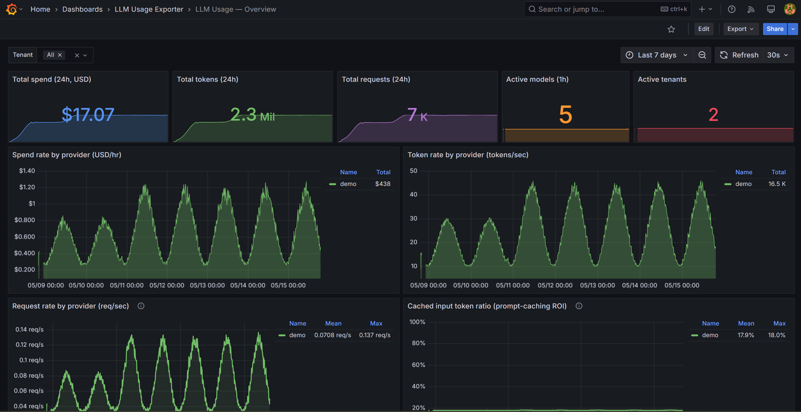
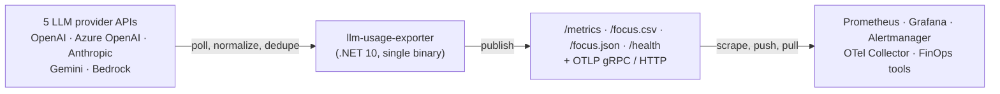

<!-- Copyright 2026 llm-usage-exporter Contributors -->
<!-- SPDX-License-Identifier: Apache-2.0 -->
<!-- See LICENSE and NOTICE in the repository root for full terms. -->

<div align="center">

# llm-usage-exporter

### LLM Cost Observability · AI FinOps · GenAI Spend Telemetry · Prometheus-Native

*Near-real-time, self-hosted, open-source Prometheus exporter for LLM usage, token consumption, request volume, and USD spend across OpenAI, Azure OpenAI, Anthropic Claude, Google Gemini, and AWS Bedrock — so platform, SRE, FinOps, and engineering teams can monitor, alert, and explain AI cost from the same Prometheus + Grafana + OpenTelemetry stack they already trust for everything else.*

[](LICENSE)
[](docs/architecture.md#roadmap-and-build-phases)
[](docs/architecture.md#tech-stack)
[](docs/architecture.md#tech-stack)
[](docs/metrics.md)
[](dashboards/)
[](deploy/docker-compose.yml)
[](https://github.com/xops-labs/llm-usage-exporter/actions/workflows/ci.yml)
[](https://github.com/xops-labs/llm-usage-exporter/actions/workflows/codeql.yml)

[](#use-cases)
[](#use-cases)
[](docs/standards.md)
[](docs/standards.md)
[](docs/standards.md)
[](docs/architecture.md#features-and-capabilities)
[](#deployment)
[](#deployment)
[](#why-it-matters)
[](docs/metrics.md)
[](CONTRIBUTING.md)

</div>

---

**`llm-usage-exporter` is an open-source Prometheus exporter for LLM cost, token, and request telemetry.** It polls **five LLM providers** — OpenAI, Azure OpenAI, Anthropic Claude, Google Gemini, AWS Bedrock — normalizes their per-bucket usage and cost records, deduplicates them, and re-publishes them as Prometheus counters and OpenTelemetry OTLP instruments — so AI workload spend becomes a near-real-time operational cost signal alongside latency, throughput, error rate, and saturation.

> **Operational signal, not invoice truth.** This exporter is built for alerting, attribution, and burn-rate dashboards — not final billing reconciliation. Provider rounding, credits, volume discounts, delayed cost finalization, currency treatment, and invoice corrections can differ from exported counters. Keep provider invoices and finance-owned systems as the legal source of record. See [docs/metrics.md → Cost metric semantics](docs/metrics.md#cost-metric-semantics) and [docs/faq.md → Is this invoice-accurate?](docs/faq.md#is-this-invoice-accurate) for specifics.

> **New here?** [`docs/developer-guide.md`](docs/developer-guide.md) is the canonical start-here walkthrough — `git clone` → first provider → wiring Prometheus / Grafana / Grafana Cloud / OTLP → alerts → budgets → multi-tenant → production Helm. Read that first; the rest of this README is the at-a-glance summary it points into.

---

## Why it matters

AI workloads are the **fastest-growing line item in the modern cloud bill** — and unlike compute or storage, they move *hourly*, not monthly. A single shipped feature with a runaway retry loop or a quietly inflated context window can turn into a six-figure month before anyone notices.

> The bill arrives 30 days too late. Engineering teams already have a feedback loop for cost, latency, and reliability — it's called **Prometheus and Grafana**. The gap was the connector.

`llm-usage-exporter` is the bridge. Point it at your provider credentials, scrape it from your existing Prometheus, and AI cost becomes the same kind of near-real-time operational signal you already alert on for CPU and request error rate.

---

## What it observes

Six surfaces — all ship today across all five providers with the same canonical metric shape:

| # | Surface | What we expose |
|---|---|---|
| 1 | **Token usage** | Input / output / total / cached-input tokens and requests, by `provider` × `model` × `tenancy_id` |
| 2 | **USD spend** | Cost in USD by `provider` × `tenancy_id` and by `provider` × `model` × `tenancy_id` |
| 3 | **Exporter self-health** | Per-provider poll success / failure, last-success timestamp, poll duration |
| 4 | **Multi-provider parity** | OpenAI, Azure OpenAI, Anthropic Claude, Google Gemini, AWS Bedrock — one unified `llm_*` metric namespace, `provider` is a label |
| 5 | **OpenTelemetry OTLP export** | Canonical `llm.usage.*` instruments emitted via OTLP gRPC + HTTP alongside Prometheus |
| 6 | **Anomaly + budget signals** | `llm_alerts_budget_burn_ratio` plus per-(tenant, provider, model) cost / token z-scores |

Findings flow into a **low-cardinality-by-default** metric surface — `user_id` / `api_key_id` labels are intentionally excluded. Full metric catalog: [docs/metrics.md](docs/metrics.md).

---

## 60-second quickstart

```bash
git clone https://github.com/xops-labs/llm-usage-exporter.git
cd llm-usage-exporter
docker compose -f deploy/docker-compose.yml up --build
```

The compose stack runs in demo mode by design — a one-shot init container seeds Prometheus with 7 days of synthetic LLM telemetry, a synthetic `provider="demo"` source keeps emitting fresh data, and all six Grafana dashboards render populated panels on first open. No credentials, no `.env`, no manual configuration required.

> **Want to point it at real providers instead?** Copy `.env.example` to `.env`, fill in the provider credentials you need (any combination of OpenAI, Azure OpenAI, Anthropic, Gemini, Bedrock — every provider is independently opt-in), and use the Helm chart at [`deploy/helm/llm-usage-exporter/`](deploy/helm/llm-usage-exporter/) for production. The compose stack itself is intentionally locked to demo mode so the quickstart never depends on credentials.

Then open:

```
http://localhost:8080/metrics    # Prometheus scrape target
http://localhost:8080/focus.json # FOCUS v1.0 records
http://localhost:8080/health     # exporter health
http://localhost:9090            # Prometheus UI
http://localhost:3000            # Grafana (admin / admin) — 6 dashboards auto-imported
```

The compose stack brings up the exporter + Prometheus + Grafana with the dashboards under [dashboards/](dashboards/) auto-provisioned via [deploy/grafana/provisioning/](deploy/grafana/provisioning/).



The five other shipped dashboards — **Cost & Budgets**, **Multi-Tenant**, **Provider Deep Dive**, **Tokens & Caching**, **Exporter Health** — render the same demo data from different angles. Previews live under [screenshots/](screenshots/).

Going further:

- **Need step-by-step from clone to Helm in production?** → [docs/developer-guide.md](docs/developer-guide.md)
- **Setting up provider credentials?** → [docs/credentials/](docs/credentials/) — one runbook per cloud
- **Deploying to Kubernetes?** → [docs/deployment.md](docs/deployment.md) + [deploy/helm/llm-usage-exporter/README.md](deploy/helm/llm-usage-exporter/README.md)
- **Hitting an issue?** → [docs/troubleshooting.md](docs/troubleshooting.md) — organized by symptom

---

## Use cases

| Role | What `llm-usage-exporter` does for you |
|---|---|
| **AI FinOps practitioner** | Near-real-time spend per project and per model, ready for operational showback, budget alerts, and downstream reconciliation. |
| **LLMOps / Platform SRE** | Alert on poll failures, stale data, abnormal token bursts, prompt-caching regressions, runaway cost. |
| **Platform engineering** | One exporter, one scrape config — a golden-path component your product teams can rely on. No SaaS contract. |
| **Cost optimization engineer** | Surface prompt-caching wins per provider, model substitution opportunities, runaway prompts. |
| **Engineering leader / VP** | Executive Grafana panels: monthly spend trend, model adoption, cost per team. |
| **CFO / Finance** | Auditable, per-team, per-model USD spend pulled from authoritative provider APIs. |
| **AI product owner** | Per-project cost telemetry so launch decisions, pricing, and unit economics have real numbers behind them. |
| **DevSecOps / Governance** | AI cost as a governed SLO. Budget burn alerts route through the same on-call pipeline as latency SLOs. |
| **AI Coding Agent (Claude, Cursor, Cline)** | Query exporter metrics via Prometheus HTTP API to make cost-aware suggestions — *"this prompt would push the project past 80% of monthly budget."* |

---

## Architecture at a glance



Five providers, three coordinated output planes (Prometheus + OTLP + FOCUS), one canonical `{tenant, provider, model, tenancy_id}` label shape on a unified `llm_*` metric namespace, per-provider isolation, decorator-friendly extension model. Full diagram, principles, tech stack, and roadmap: [docs/architecture.md](docs/architecture.md).

---

## OpenTelemetry compatibility

The exporter emits OTLP alongside Prometheus. Its metric and attribute names predate the [OTel GenAI semantic conventions](https://opentelemetry.io/docs/specs/semconv/gen-ai/) and target a fundamentally different data model — **aggregate historical usage** polled from provider billing APIs on a configurable cadence, not per-request client-side instrumentation — so the names are intentionally different rather than accidentally divergent.

### Attribute and metric name mapping

| Exporter concept | Exporter name | Candidate OTel GenAI name | Alignment notes |
|---|---|---|---|
| Provider identity | `provider` label | `gen_ai.system` | Semantically equivalent; string values differ (see table below). |
| Model identifier | `model` label | `gen_ai.request.model` | Same string — provider-reported model ID. Could alias directly. |
| Exporter tenant | `tenant` label | *(none — exporter-specific)* | Multi-tenancy dimension for the exporter itself; no OTel GenAI equivalent. |
| Provider tenancy scope | `tenancy_id` label | *(none — exporter-specific)* | Provider-native org / project / workspace / region scoping. No OTel GenAI equivalent. |
| USD cost (per tenancy) | `llm.usage.cost_usd` OTLP instrument | *(none — not in spec)* | Exporter-owned. OTel GenAI does not define a cost metric; USD cost is a billing-API aggregate, not instrumentable per-request. |
| USD cost (per model) | `llm.usage.cost_usd_by_model` OTLP instrument | *(none — not in spec)* | Exporter-owned; same reasoning. |
| Token throughput | `llm.usage.input_tokens`, `llm.usage.output_tokens`, `llm.usage.cached_input_tokens`, … | `gen_ai.client.token.usage` | OTel GenAI uses a single instrument with a `gen_ai.token.type` attribute (`input` / `output` / `input.cached`); the exporter uses separate counters. Shape differs; semantics are equivalent. |
| Alert / anomaly gauges | `llm_alerts_budget_burn_ratio`, `llm_alerts_cost_anomaly_score`, … | *(none)* | Exporter-owned. Budget burn and z-score anomaly signals have no OTel GenAI analogue. |

#### `provider` → `gen_ai.system` value mapping

| Exporter `provider` value | Candidate `gen_ai.system` value | Notes |
|---|---|---|
| `openai` | `openai` | Exact match. |
| `azure_openai` | `azure.openai` | Underscore vs. dot separator. |
| `anthropic` | `anthropic` | Exact match. |
| `gemini` | `google_vertex_ai` | The OTel GenAI spec uses `google_vertex_ai`; this exporter targets the Gemini Developer API, not Vertex AI directly — a closer upstream value may be defined as the spec matures. |
| `bedrock` | `aws.bedrock` | Prefix format differs. |

### Why the naming diverges

OTel GenAI semantic conventions target **per-request client-side instrumentation** — a single LLM call that returns a response with a known token count and latency. This exporter targets an entirely different use case: **aggregate historical usage** surfaced by provider billing and usage APIs. There is no per-request hook; the exporter never intercepts individual calls.

Practical consequences of the aggregate-history model:
- Token and cost figures arrive in time-bucketed API responses (hourly or daily rollups), not as in-flight spans.
- No distributed trace context is available to correlate records to individual requests.
- A single API record already aggregates thousands of calls, so per-call `gen_ai.client.operation.duration` histograms have no equivalent here.

This is not a gap in OTel GenAI — it is a **complementary observability plane**. OTel GenAI instruments tell you what each call did; this exporter's OTLP output tells you what the provider billed you for all of them. Both belong in the same stack; neither replaces the other.

### Planned attribute-alignment mode (opt-in)

`OTEL_GENAI_ATTRIBUTE_ALIGNMENT_MODE=true` is the proposed flag for a future experimental mode that would emit `gen_ai.system` alongside `provider` and `gen_ai.request.model` alongside `model` on all OTLP instruments. This would make the exporter's OTLP output joinable against OTel GenAI-instrumented spans in backends that support attribute-based joins without renaming or removing existing attributes.

Rules for this mode:
- **Additive only.** Canonical metric names (`llm.usage.*`) and existing attribute names (`provider`, `model`, `tenant`, `tenancy_id`) are unchanged.
- **No remapping of exporter-specific dimensions.** `tenant`, `tenancy_id`, cost instruments, and `llm_alerts_*` gauges have no OTel GenAI counterpart and are left as-is.
- **Experimental.** The `gen_ai.system` value set and the per-instrument shape of `gen_ai.client.token.usage` are still evolving upstream; this mode may require updates as the spec stabilises.

> **Roadmap note.** `OTEL_GENAI_ATTRIBUTE_ALIGNMENT_MODE` is not shipped yet. Today the exporter emits canonical `llm.usage.*` OTLP instruments only. Contributions are welcome — see [CONTRIBUTING.md](CONTRIBUTING.md).

### Upstream OTel engagement

The aggregate-history billing use case is architecturally distinct from per-request instrumentation and warrants a dedicated discussion with the OTel GenAI SIG. No upstream issue or SIG discussion has been opened yet; that is a post-launch action after the data-model boundary is documented clearly and early users can provide concrete examples. The intended question is whether a `gen_ai.aggregate.*` or `gen_ai.billing.*` convention family makes sense upstream, while preserving this exporter's `llm.usage.*` metrics for compatibility.

### Roadmap boundaries

Two related items are deliberately **not shipped** in the current release: FOCUS 1.3 output and an external checkpoint store for active-active HA. Current FOCUS endpoints remain frozen at the FOCUS 1.0 shape; see [docs/focus-roadmap.md](docs/focus-roadmap.md). Current HA guidance is one replica per tenant/provider shard with file-backed checkpoints for restart safety; see [docs/ha-and-checkpoints.md](docs/ha-and-checkpoints.md).

---

<a id="deployment"></a>
## Deployment

| Path | Where to go |
|---|---|
| **Local Docker** | The 60-second quickstart above |
| **Kubernetes (Helm chart)** | [deploy/helm/llm-usage-exporter/README.md](deploy/helm/llm-usage-exporter/README.md) — install command, six worked examples, full values reference |
| **Production-targeted Helm values + deployment checklist** | [docs/deployment.md](docs/deployment.md) — image verification, auth in front of `/metrics`, sizing table, HA caveat, upgrade path, tenant rotation, budget ConfigMap |
| **Grafana Cloud (Prometheus remote_write or OTLP)** | [docs/developer-guide.md → Step 6](docs/developer-guide.md#step-6--wire-grafana-self-hosted-or-grafana-cloud) — both patterns with endpoint URLs and auth-header format |
| **OpenTelemetry Collector** | [deploy/otel-collector/](deploy/otel-collector/) — complete working config, four downstream backends |
| **Prometheus alerting** | [deploy/alerts/](deploy/alerts/) — 11 alerts in 3 groups, checked by `promtool` |

Every released container image is signed by `cosign` keyless against Sigstore Fulcio, ships with embedded SLSA L3 build provenance and embedded SBOMs, and is accompanied by CycloneDX (source) + SPDX (image) SBOMs attached to the GitHub Release. Verify before deploying:

```bash
cosign verify ghcr.io/xops-labs/llm-usage-exporter:<tag> \
  --certificate-identity-regexp "https://github.com/xops-labs/llm-usage-exporter/.*" \
  --certificate-oidc-issuer "https://token.actions.githubusercontent.com"
```

Full supply-chain story: [SECURITY.md](SECURITY.md) + [docs/standards.md](docs/standards.md).

---

## Commercial use

`llm-usage-exporter` is licensed under the Apache License 2.0. You may use it in startups, internal platforms,
commercial products, consulting work, and production environments without asking for permission.

Apache-2.0 allows commercial use, modification, distribution, and private use. If you redistribute the software or a
modified version, preserve the license, copyright notices, and [NOTICE](NOTICE) file as required by the license.

---

## Data and privacy

`llm-usage-exporter` is an aggregate usage and cost exporter. It does not proxy LLM inference traffic and does not
collect, store, or export prompt text or model response text.

The exporter polls provider usage, billing, monitoring, and cost APIs, then emits operational telemetry such as token
counts, request counts, model names, provider identifiers, tenant labels, polling health, budget signals, anomaly
scores, and USD cost metrics.

The exported metrics and FOCUS records can still be sensitive because they may reveal model usage, project names, tenant
identifiers, spend patterns, and operational behavior. Protect `/metrics`, `/focus.csv`, `/focus.json`, and `/health`
behind internal networking, mTLS, service-mesh authorization, or an authenticated reverse proxy.

Provider API keys, tenant bearer tokens, cloud credentials, and OTLP headers must be supplied through environment
variables or secret managers. Do not commit `.env`, cloud keyfiles, API keys, OTLP headers, or logs containing
credentials. See [docs/security-secrets.md](docs/security-secrets.md) for production secret handling.

---

## Attribution

Attribution is not required for using `llm-usage-exporter`, but it is appreciated.

If this project helps your startup, team, or platform, you can support it by:

- Starring the repository
- Mentioning `llm-usage-exporter` in your docs, blog, architecture notes, or internal platform guides
- Adding your organization, startup, team, or project to [ADOPTERS.md](ADOPTERS.md)
- Sharing a case study, feedback, dashboard screenshot, or production lesson learned
- Opening issues, pull requests, documentation improvements, provider integrations, or dashboard enhancements

For redistributed copies or modified versions, keep the Apache-2.0 license, copyright notices, and [NOTICE](NOTICE) file intact.

---

## Documentation map

| Audience | Document |
|---|---|
| **First-time reader** | [docs/developer-guide.md](docs/developer-guide.md) — end-to-end walkthrough |
| **Want to understand the design** | [docs/architecture.md](docs/architecture.md) — architecture, tech stack, features, roadmap, repo layout |
| **Configuring an env var or value** | [docs/configuration.md](docs/configuration.md) — every env var the exporter understands |
| **Querying / alerting on the metrics** | [docs/metrics.md](docs/metrics.md) — canonical metric catalog + scrape output example |
| **Setting up cloud credentials** | [docs/credentials/](docs/credentials/) — one runbook per provider |
| **Understanding provider HTTP semantics** | [docs/provider-apis.md](docs/provider-apis.md) — pagination, auth, retry, references |
| **Open standards and supply chain** | [docs/standards.md](docs/standards.md) — Prometheus, OpenMetrics, OTLP, FOCUS, SLSA, SBOMs |
| **Production deployment to Kubernetes** | [docs/deployment.md](docs/deployment.md) — 10-step guide |
| **Helm chart specifics** | [deploy/helm/llm-usage-exporter/README.md](deploy/helm/llm-usage-exporter/README.md) |
| **Operating in production** | [docs/troubleshooting.md](docs/troubleshooting.md) — symptom-organized runbook |
| **Prometheus alerts** | [deploy/alerts/README.md](deploy/alerts/README.md) |
| **OTel Collector wiring** | [deploy/otel-collector/README.md](deploy/otel-collector/README.md) |
| **Roadmap and future direction** | [ROADMAP.md](ROADMAP.md) |
| **Public adopters and case studies** | [ADOPTERS.md](ADOPTERS.md) |
| **General questions** | [docs/faq.md](docs/faq.md) |
| **Per-version release notes** | [CHANGELOG.md](CHANGELOG.md) |
| **Contributing workflow** | [CONTRIBUTING.md](CONTRIBUTING.md) + [GOVERNANCE.md](GOVERNANCE.md) + [MAINTAINERS.md](MAINTAINERS.md) |
| **Security policy** | [SECURITY.md](SECURITY.md) |
| **Getting help** | [SUPPORT.md](SUPPORT.md) |

---

## Topics this repository covers

`llm` · `llm-observability` · `llm-cost-monitoring` · `llmops` · `ai-finops` · `ai-cost-tracking` · `ai-spend-tracking` · `ai-cost-optimization` · `ai-cost-governance` · `ai-budget-alerts` · `ai-chargeback` · `ai-showback` · `genai` · `genai-observability` · `genai-cost` · `token-usage` · `token-tracking` · `token-analytics` · `prompt-caching` · `model-adoption-metrics` · `openai` · `openai-usage` · `openai-cost` · `openai-prometheus-exporter` · `openai-exporter` · `gpt-4` · `gpt-4o` · `chatgpt-enterprise-cost-tracking` · `azure-openai` · `anthropic-claude` · `claude-cost-tracking` · `google-gemini` · `vertex-ai-billing` · `aws-bedrock` · `bedrock-cost` · `prometheus` · `prometheus-exporter` · `prometheus-metrics` · `openmetrics` · `grafana` · `grafana-dashboard` · `alertmanager` · `opentelemetry` · `otlp` · `otel-collector` · `focus-spec` · `finops` · `finops-foundation` · `cloud-cost-management` · `cloud-cost-optimization` · `multi-cloud` · `aws` · `azure` · `gcp` · `cncf` · `cloud-native` · `kubernetes` · `helm` · `servicemonitor` · `dotnet` · `dotnet-10` · `aspnet-core` · `csharp` · `docker` · `docker-compose` · `ghcr` · `multi-arch` · `arm64` · `sre` · `devsecops` · `platform-engineering` · `observability` · `monitoring` · `metrics-exporter` · `metrics` · `self-hosted` · `open-source` · `apache-2-0` · `semver` · `keep-a-changelog` · `codeql` · `dependabot` · `github-actions` · `model-context-protocol` · `mcp` · `ai-agent` · `claude` · `cursor` · `cline` · `continue` · `anthropic`

---

## License

**[Apache License 2.0](LICENSE)** — permissive, OSI-approved, commercial-use-friendly.

Copyright © 2026 llm-usage-exporter Contributors. See [AUTHORS.md](AUTHORS.md) and [NOTICE](NOTICE) for attribution.

---

## Contributing · Security · Maintainer

- Contributing workflow: see **[CONTRIBUTING.md](CONTRIBUTING.md)**.
- Private security disclosure: see **[SECURITY.md](SECURITY.md)**.
- Created and maintained by **[Yasvanth Udayakumar](https://www.linkedin.com/in/yasvanth-udayakumar-55298042/)** with the **[@xops-labs/maintainers](https://github.com/orgs/xops-labs/teams/maintainers)** team. See **[MAINTAINERS.md](MAINTAINERS.md)**.

---

<div align="center">

**llm-usage-exporter** · Near-real-time LLM cost observability · Apache-2.0 · Built for AI FinOps and LLMOps

*If `llm-usage-exporter` saves you a single budget surprise, please star the repo — it's the cheapest cost signal we ship.*

Created and maintained by [Yasvanth Udayakumar](https://www.linkedin.com/in/yasvanth-udayakumar-55298042/).

</div>
