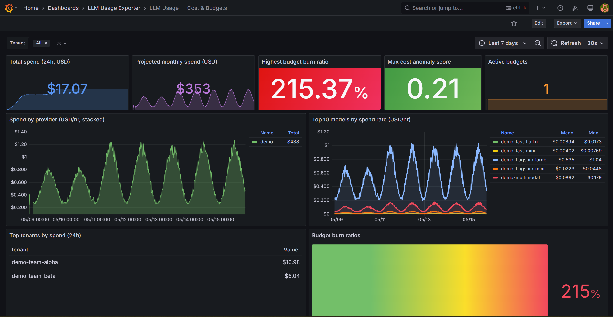

# Alertmanager rules

Recommended starting-point Prometheus alerting rules for the `llm-usage-exporter`. Three rule groups:



| Group | Purpose |
|---|---|
| `llm-usage-exporter.health` | The exporter itself: target down, /health unhealthy, poll failures, stale data, slow polls |
| `llm-usage-exporter.budgets` | Per-budget burn ratio at 50% / 80% / 100% — keyed by `budget_name` |
| `llm-usage-exporter.anomalies` | Per-(tenant, provider, model) cost / token z-scores at ±2σ / ±3σ |

## Wiring into Prometheus

### Vanilla Prometheus

Drop `llm-usage-exporter.rules.yml` somewhere Prometheus can read it and reference it in your prometheus.yml:

```yaml
rule_files:
  - /etc/prometheus/rules/llm-usage-exporter.rules.yml
```

Reload Prometheus (`SIGHUP` or `POST /-/reload`). Verify rules loaded via `GET /api/v1/rules`.

### Prometheus Operator

Wrap the same rule groups in a `PrometheusRule` CRD. Example:

```yaml
apiVersion: monitoring.coreos.com/v1
kind: PrometheusRule
metadata:
  name: llm-usage-exporter
  namespace: observability
  labels:
    release: kube-prometheus-stack   # match your Prometheus Operator's ruleSelector
spec:
  groups:
    # paste the contents of llm-usage-exporter.rules.yml's `groups:` array here
```

The operator picks it up automatically.

## Severity ladder

The rules use three severity levels — adjust for your on-call setup:

| Severity | When | Suggested routing |
|---|---|---|
| `info` | Heads-up only (50% budget burn, slow polls) | Dashboard banner / chat-only |
| `warning` | Action recommended (80% budget burn, 2σ anomaly, provider failures) | Working-hours pager |
| `critical` | Action required (budget exceeded, 3σ anomaly, exporter down) | 24/7 pager |

## Understanding the two kinds of delay

Before wiring alerts, it is important to distinguish two fundamentally different delay sources that affect when an alert fires:

### 1. Exporter failure delay — the exporter is not polling

This is signalled by `LlmUsageExporterDown`, `LlmUsageExporterUnhealthy`, `LlmUsageExporterPollFailures`, and `LlmUsageExporterStale`. When these fire, **the exporter has stopped collecting data entirely** — credentials rotated, upstream API unreachable, pod crashed. Budget and anomaly alerts will go flat. Treat these as infrastructure incidents requiring immediate remediation.

### 2. Provider data delay — the exporter is healthy but cost data is inherently late

This is **not** signalled by any alert and is expected behaviour. Provider billing-history APIs publish cost data on their own schedule, independent of how often the exporter polls:

| Provider | Token data available | Cost data available |
|---|---|---|
| OpenAI | Within minutes | ~1–2 hours after usage |
| Azure OpenAI | Within minutes (Azure Monitor) | **24–72 hours** after usage (Cost Management) |
| Anthropic | Within minutes | ~1–4 hours after usage |
| Google Gemini | Within minutes (Cloud Monitoring) | **1–2 days** after usage (BigQuery billing export) |
| AWS Bedrock | Within minutes (CloudWatch) | **24–48 hours** after usage (Cost Explorer) |

Consequence for budget alerts: `LlmBudgetBurnHigh` firing today means the reported spend crossed 80% of the budget **as of the data the provider has published so far** — actual spend may already be higher for providers with long cost-finalization lags. Budget alert `for:` durations are deliberately set to 5–10 minutes to smooth poll noise; they are not a substitute for faster-than-billing cost awareness.

Consequence for anomaly alerts: `LlmCostAnomaly` and `LlmCostAnomalySevere` reflect anomalies in the delayed cost stream. For faster detection of runaway spend, watch `LlmTokenAnomalySevere` — token throughput data is available within minutes from all providers and is a reliable leading indicator of cost anomalies.

### Alert timing summary

| Alert | Fires because | Indicates |
|---|---|---|
| `LlmUsageExporterDown` | No scrape / pod gone | Exporter infrastructure failure |
| `LlmUsageExporterStale` | Poll succeeds but data is very old | Likely credential or API outage per provider |
| `LlmBudgetBurn*` | Cost counter crossed threshold | Actual spend ≥ threshold (may lag reality by hours) |
| `LlmCostAnomaly*` | Cost z-score anomaly | Anomaly in delayed cost stream |
| `LlmTokenAnomalySevere` | Token z-score anomaly | Near-real-time leading indicator of cost movement |

## Routing `llm_alerts_*` to Alertmanager

The exporter emits four gauge families that are *alert-shaped already* — no `rate()` or windowing required:

| Gauge | What it represents | Natural alert pattern |
|---|---|---|
| `llm_alerts_budget_burn_ratio{budget_name}` | Spend ÷ limit for the current period (0.0 – 1.0+) | Threshold ladder: 0.5 → info, 0.8 → warning, 1.0 → critical |
| `llm_alerts_budget_spend_usd{budget_name}` | Absolute USD spent in the current period | Use as annotation; pair with `llm_alerts_budget_limit_usd` |
| `llm_alerts_cost_anomaly_score{tenant,provider,model}` | Z-score of latest cost bucket vs rolling baseline (clamped to ±10) | `abs(...) >= 2` → warning, `>= 3` → critical |
| `llm_alerts_token_anomaly_score{tenant,provider,model}` | Z-score of token throughput | Usually a *leading indicator* for cost anomalies — alert at `>= 3` |

The shipped rules in [llm-usage-exporter.rules.yml](llm-usage-exporter.rules.yml) already wire these gauges into PromQL alerts at three thresholds. The block below is the Alertmanager-side configuration that turns those alerts into routed notifications.

### Alertmanager configuration

Drop this into your existing `alertmanager.yml` (merge with whatever you already have). It splits the `llm-usage-exporter` alerts into three routes — budget alerts to FinOps, anomaly alerts to the ML / platform on-call, exporter-health alerts to platform SRE — and applies inhibition so a `critical` burn does not also page about the matching `warning` and `info` rungs.

```yaml
# alertmanager.yml
global:
  resolve_timeout: 5m
  slack_api_url_file: /etc/alertmanager/secrets/slack-webhook

route:
  receiver: default
  group_by: ["alertname", "budget_name", "tenant", "provider", "model"]
  group_wait: 30s
  group_interval: 5m
  repeat_interval: 4h

  routes:
    # 1. Budget alerts → FinOps team
    - matchers:
        - component = llm-usage-exporter
        - alertname =~ "LlmBudget.*"
      receiver: finops
      group_by: ["budget_name"]
      routes:
        - matchers: [severity = critical]   # budget exceeded
          receiver: finops-pagerduty
          group_wait: 0s
          repeat_interval: 1h
        - matchers: [severity = warning]    # 80% burn
          receiver: finops-slack-urgent
        - matchers: [severity = info]       # 50% burn
          receiver: finops-slack-heads-up

    # 2. Anomaly alerts → ML / platform on-call
    - matchers:
        - component = llm-usage-exporter
        - alertname =~ "Llm(Cost|Token)Anomaly.*"
      receiver: llmops-slack
      group_by: ["tenant", "provider", "model"]
      routes:
        - matchers: [severity = critical]   # ±3σ
          receiver: llmops-pagerduty
          group_wait: 0s

    # 3. Exporter-health alerts → platform SRE
    - matchers:
        - component = llm-usage-exporter
        - alertname =~ "LlmUsageExporter.*"
      receiver: platform-sre

receivers:
  - name: default
    slack_configs:
      - channel: "#alerts"
        send_resolved: true

  - name: finops-slack-heads-up
    slack_configs:
      - channel: "#finops-ai-spend"
        title: '[{{ .Status | toUpper }}] {{ .CommonLabels.alertname }}'
        text: |
          *Budget:* `{{ .CommonLabels.budget_name }}`
          *Burn:* {{ .CommonAnnotations.summary }}
          {{ .CommonAnnotations.description }}
        send_resolved: true

  - name: finops-slack-urgent
    slack_configs:
      - channel: "#finops-ai-spend"
        title: '[WARNING] Budget {{ .CommonLabels.budget_name }} 80%+'
        text: '{{ .CommonAnnotations.description }}'
        send_resolved: true

  - name: finops-pagerduty
    pagerduty_configs:
      - service_key_file: /etc/alertmanager/secrets/pd-finops-key
        description: 'Budget {{ .CommonLabels.budget_name }} EXCEEDED'
        severity: critical
        details:
          budget: '{{ .CommonLabels.budget_name }}'
          summary: '{{ .CommonAnnotations.summary }}'
          runbook: 'https://runbooks.example.com/llm-budget-exceeded'

  - name: llmops-slack
    slack_configs:
      - channel: "#llmops-anomalies"
        title: '[{{ .Status | toUpper }}] {{ .CommonLabels.alertname }}'
        text: |
          *Tenant:* `{{ .CommonLabels.tenant }}` *Provider:* `{{ .CommonLabels.provider }}` *Model:* `{{ .CommonLabels.model }}`
          *Z-score:* {{ .CommonAnnotations.summary }}
        send_resolved: true

  - name: llmops-pagerduty
    pagerduty_configs:
      - service_key_file: /etc/alertmanager/secrets/pd-llmops-key
        description: 'Severe LLM anomaly {{ .CommonLabels.provider }}/{{ .CommonLabels.model }}'
        severity: critical

  - name: platform-sre
    pagerduty_configs:
      - service_key_file: /etc/alertmanager/secrets/pd-sre-key
        description: '{{ .CommonAnnotations.summary }}'
        severity: '{{ .CommonLabels.severity }}'

# Suppress lower-severity rungs of the same budget once a higher rung fires.
inhibit_rules:
  - source_matchers: [alertname = LlmBudgetExceeded]
    target_matchers: [alertname =~ "LlmBudgetBurn.*"]
    equal: ["budget_name"]

  - source_matchers: [alertname = LlmBudgetBurnHigh]
    target_matchers: [alertname = LlmBudgetBurnEarly]
    equal: ["budget_name"]

  - source_matchers: [alertname = LlmCostAnomalySevere]
    target_matchers: [alertname = LlmCostAnomaly]
    equal: ["tenant", "provider", "model"]
```

A few notes about the routing above:

- **`component=llm-usage-exporter`** is the discriminator. Every shipped rule applies that label, so a single `matchers:` clause keeps these alerts from leaking into your generic on-call route.
- **`group_by` per route is intentional.** Budget alerts group by `budget_name` so one team gets one notification per budget. Anomaly alerts group by `(tenant, provider, model)` so a single workload's burst doesn't fan out across three teams.
- **Inhibition collapses the threshold ladder.** When `LlmBudgetExceeded` fires, the `BurnHigh` and `BurnEarly` alerts for the same budget are suppressed — the team gets one page, not three.
- **`group_wait: 0s` on critical paths** sends the first critical notification immediately. The default 30s `group_wait` is fine for info/warning batching.

### Slack-only minimal example

If you don't run PagerDuty, the simplest viable routing is:

```yaml
route:
  receiver: slack-ai-alerts
  group_by: ["alertname", "budget_name", "tenant", "provider", "model"]
  routes:
    - matchers:
        - component = llm-usage-exporter
      receiver: slack-ai-alerts

receivers:
  - name: slack-ai-alerts
    slack_configs:
      - channel: "#ai-cost-alerts"
        title: '[{{ .Status | toUpper }}:{{ .CommonLabels.severity }}] {{ .CommonLabels.alertname }}'
        text: |
          {{ range .Alerts }}*Summary:* {{ .Annotations.summary }}
          {{ .Annotations.description }}
          {{ end }}
        send_resolved: true
```

### Microsoft Teams via webhook

Replace `slack_configs:` with `webhook_configs:` pointed at your Teams incoming-webhook URL — the alert payload still carries `alertname`, `severity`, `budget_name`, and the rest of the labels, and a small Logic App or Power Automate flow can format the Adaptive Card.

### Verifying the routing

After deploying, fire a test alert directly through the Alertmanager API to confirm each route lands in the right destination *without* waiting for a real budget burn or anomaly:

```bash
curl -X POST http://alertmanager:9093/api/v2/alerts -H 'Content-Type: application/json' -d '[
  {
    "labels": {
      "alertname": "LlmBudgetBurnHigh",
      "severity": "warning",
      "component": "llm-usage-exporter",
      "budget_name": "monthly-eng"
    },
    "annotations": {
      "summary": "Budget monthly-eng at 82%",
      "description": "Synthetic test alert from routing verification."
    }
  }
]'
```

Use [amtool](https://github.com/prometheus/alertmanager#amtool) to validate your config and dry-run the routing tree:

```bash
amtool config check alertmanager.yml
amtool config routes test --config.file=alertmanager.yml \
  alertname=LlmBudgetExceeded severity=critical component=llm-usage-exporter budget_name=monthly-eng
```

The second command prints which receiver(s) the alert would land in — useful as a CI gate when changing the routing tree.

## Tuning

- `llm_alerts_*` gauges are emitted by the exporter's `AlertEvaluator` hosted service. Adjust `ALERTS_EVALUATION_INTERVAL_SECONDS` (default 60s) if you want finer-grained anomaly evaluation.
- Anomaly z-scores are clamped to ±10. The thresholds in this file (±2, ±3) are starting points — every workload's normal variance is different.
- `for: 5m` / `for: 10m` durations smooth out single-poll noise. Tighten them only if your poll interval is shorter than 300s.

## Testing the rules

Use `promtool` to validate the rule file before deployment:

```sh
promtool check rules deploy/alerts/llm-usage-exporter.rules.yml
```

And to dry-run against a recorded set of metrics:

```sh
promtool test rules <path-to-test-cases>
```
