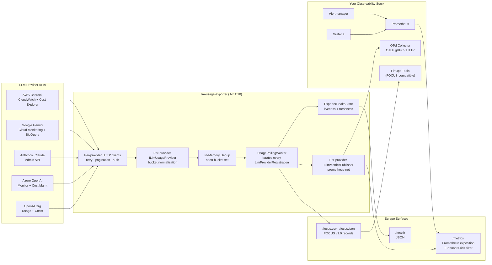
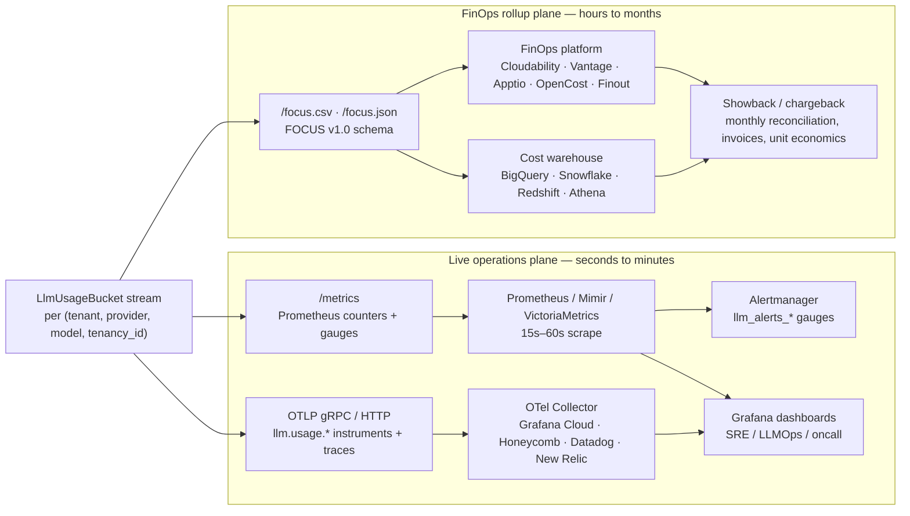

# Architecture and design

The exporter is a single-binary .NET 10 service that polls five LLM provider APIs, normalizes their per-bucket usage and cost records into one canonical shape, and republishes them on three coordinated output planes — Prometheus exposition at `/metrics`, OpenTelemetry OTLP for metrics and traces, and FOCUS v1.0 cost records at `/focus.csv` and `/focus.json`.

## Diagram



## Two output planes, two audiences

The three surfaces (`/metrics`, OTLP, `/focus.*`) intentionally split into **two output planes** serving two different audiences and cadences. The Prometheus + OTLP plane carries near-real-time operational signal; the FOCUS plane carries normalized cost-and-usage rollups for accounting and chargeback. Same `LlmUsageBucket` stream, two consumers, neither blocks the other.



| Plane | Surface | Cadence | Consumer | What it answers |
|---|---|---|---|---|
| **Live operations** | `/metrics` (Prometheus) · OTLP | 15 s – 5 min | Prometheus, OTel Collector, Alertmanager, Grafana | "Is spend spiking *right now*? Is a budget burning? Did caching regress this hour? Is a provider failing?" |
| **FinOps rollups** | `/focus.csv` · `/focus.json` | Hourly / daily / monthly | Cloudability, Vantage, Apptio, OpenCost, Finout, BigQuery, Snowflake | "What did Team A spend last month, per model, per tenant — joined to cloud spend in the same FOCUS schema as our compute and storage bills?" |

The two planes are not redundant — they are **deliberately different shapes for deliberately different jobs**. Counters and gauges on the live plane are dimensioned for low-cardinality alerting and dashboards; FOCUS records on the rollup plane are dimensioned for accounting, chargeback, and downstream join with cloud-provider bills. Provider invoices remain the source of record for both.

## Principles

- **Schema-stable metrics.** Every provider emits the same unified `llm_*` metric families with a canonical `{tenant, provider, model, tenancy_id}` label set. The provider name is a label, not a metric-name prefix. The `tenancy_id` slot carries whichever native identifier the provider uses to scope organization-level usage — OpenAI / Gemini project, Anthropic workspace, Azure OpenAI resource, Bedrock region — and the `provider` label disambiguates which kind of ID applies. `tenant` is always the first label and defaults to `"default"` in single-tenant mode. Dashboards survive provider additions without rewriting queries.
- **Low cardinality is non-negotiable.** `user_id` and API-key labels are explicitly excluded. Prometheus bills explode in proportion to label cardinality; this exporter respects that.
- **Durable when you need it.** In-memory dedup keeps the hot path stateless; opt into `FileCheckpointStore` to persist seen-bucket identities across restarts so a crash-restart never re-emits historical counters.
- **One container, two output planes.** Prometheus exposition at `/metrics` and OpenTelemetry OTLP export (gRPC + HTTP) run side by side from the same `LlmUsageBucket` stream. A single ASP.NET Core process that fits anywhere you already run Prometheus exporters, OTel collectors, or both.
- **Provider-pluggable.** Each provider is an `ILlmUsageProvider` registered via a single `AddXProvider(...)` extension method that wires it into the unified `LlmMetricsPublisher` (one shared publisher per (tenant, provider) pair, sharing one metric-family registration across all providers). The polling worker iterates every registration independently — a failure in one provider does not stop the others. Adding a new provider is a contained PR, not a fork.
- **Multi-tenant by configuration.** Set `Tenants.Items` and the exporter registers one independent `LlmProviderRegistration` per `(tenant, provider)` pair. `/metrics?tenant=<id>` filters the exposition; `Tenants.ApiKeys` gates tenant-scoped scrapes behind bearer tokens.
- **Decorator-friendly.** New cross-cutting features (alerts, FOCUS export) plug in through `IRegistrationDecorator` without touching existing providers or publishers — the worker applies every registered decorator in order before iterating.
- **No vendor SDKs.** Every provider talks raw HTTP — Azure AD client-credentials, Anthropic admin headers, GCP JWT-bearer, and AWS SigV4 are all hand-rolled with `System.Net.Http` and `System.Security.Cryptography`. Beyond `prometheus-net.AspNetCore` and the two OpenTelemetry packages, zero NuGet dependencies.

## Engineering conventions

- **Schema-stable metrics.** Adding a provider must not break existing dashboard PromQL. New labels require an RFC.
- **Tenant safety.** No label is allowed to leak end-user identity. Project IDs are the lowest tenant grain we expose. The `tenant` label exists for multi-tenant deployments and defaults to `"default"` in single-tenant mode.
- **Stateless by default, durable on opt-in.** The default in-memory dedup is rebuilt from the rolling window on restart. Operators who want crash-restart safety for historical buckets can switch to `CHECKPOINTS_PROVIDER=File` without code changes.
- **Decorator-friendly.** Cross-cutting concerns (alerts, FOCUS export) plug in through `IRegistrationDecorator` without touching providers or publishers.
- **Configuration over code.** Everything tweakable is an env var. No app restart should require a code change.
- **Findings are derived, not stored.** The exporter owns no source of truth; it republishes provider data. The provider remains authoritative.
- **One container, two output planes.** Prometheus exposition at `/metrics` and OpenTelemetry OTLP (metrics + traces with W3C `traceparent` propagation enabled by default) run side by side from the same `LlmUsageBucket` stream. Set `OTEL_TRACE_CONTEXT_PROPAGATION_ENABLED=false` to keep trace IDs inside the exporter boundary. No sidecars, no agents, no proprietary collector required.

## Tech stack

| Layer | Technology | Why |
|---|---|---|
| **Runtime** | .NET 10 · ASP.NET Core | Long-term Microsoft support, AOT-friendly, mature HTTP + DI surface |
| **Metrics library** | `prometheus-net.AspNetCore` 8.x | First-class Prometheus client for .NET, OpenMetrics-compatible |
| **HTTP client** | `HttpClientFactory` + typed clients | Pooled connections, resilience-policy ready (Polly-compatible) |
| **Background polling** | `IHostedService` / `BackgroundService` | Native cancellation, graceful shutdown, single-process scheduling |
| **Configuration** | `IOptions<T>` + environment variables | 12-factor, container-friendly, no config files required |
| **Logging** | `Microsoft.Extensions.Logging` (structured) | Plugs into Serilog, OpenTelemetry, Datadog, Splunk, Azure App Insights |
| **Container image** | Multi-stage Dockerfile, multi-arch (amd64 + arm64) | Runs on standard cloud nodes *and* on ARM Kubernetes pools |
| **Local orchestration** | Docker Compose | One command from clone to dashboards |
| **CI** | GitHub Actions, Ubuntu + Windows matrix | Verifies cross-platform .NET behavior |
| **Security scanning** | CodeQL (`csharp` + `actions`) | Catches both code bugs and overprivileged workflows |
| **Dependency hygiene** | Dependabot (NuGet + Actions + Docker) | Weekly, grouped, low-noise update PRs |
| **Release pipeline** | GitHub Actions tag-driven, GHCR push | Multi-arch container images, semver tags, changelog-extracted notes |
| **License** | Apache-2.0 | Permissive, business-friendly, OSI-approved |

## Features and capabilities

| # | Capability | Phase | Status |
|---|---|---|---|
| 01 | **OpenAI completions usage polling** — input / output / cached / total tokens, requests, by `model` × `tenancy_id` (project) | 1 | Active |
| 02 | **OpenAI cost polling** — organization-level USD spend, with `line_item` → `model` mapping | 1 | Active |
| 03 | **In-memory bucket deduplication** — collapses repeat buckets across overlapping polls | 1 | Active |
| 04 | **Prometheus `/metrics` endpoint** — text exposition format, scrapable by every Prometheus-compatible TSDB | 1 | Active |
| 05 | **Exporter self-health metrics** — poll success/failure counters, last-success timestamp, poll duration | 1 | Active |
| 06 | **`/health` endpoint** — liveness + data-freshness, JSON | 1 | Active |
| 07 | **Environment-variable configuration** — no config files, 12-factor friendly | 1 | Active |
| 08 | **Project filtering** — narrow polling to a subset of `OPENAI_PROJECT_IDS` | 1 | Active |
| 09 | **Docker Compose deployment** — exporter + Prometheus in one `up --build` | 1 | Active |
| 10 | **Grafana starter dashboard** — spend, tokens, model adoption, cached-token ratio, exporter SLOs | 1 | Active |
| 11 | **CI on Ubuntu + Windows** — build, test, Docker image, community-file sanity | 1 | Active |
| 12 | **CodeQL security scanning** — C# + GitHub Actions analyzers, weekly schedule | 1 | Active |
| 13 | **Tag-driven GHCR releases** — multi-arch (amd64 + arm64), changelog-extracted notes | 1 | Active |
| 14 | **Azure OpenAI provider** — deployment-level usage from Azure Monitor + Azure Cost Management join | 2 | Active |
| 15 | **Anthropic Claude provider** — Admin API usage and cost reports with prompt-caching split | 2 | Active |
| 16 | **Google Gemini provider** — Vertex AI Cloud Monitoring + BigQuery billing export | 3 | Active |
| 17 | **AWS Bedrock provider** — CloudWatch invocation metrics + Cost Explorer with inline SigV4 | 3 | Active |
| 18 | **OpenTelemetry OTLP export** — canonical `llm.usage.*` instruments emitted alongside Prometheus | 3 | Active |
| 19 | **Helm chart** — first-class Kubernetes deployment, with ServiceMonitor + per-provider Secrets | 3 | Active |
| 20 | **Durable checkpoint storage** — `FileCheckpointStore` survives restarts without re-scanning the window | 4 | Active |
| 21 | **Multi-tenant mode** — one exporter, many orgs, per-tenant credentials + `tenant` label + RBAC-scoped scrape | 4 | Active |
| 22 | **Anomaly + budget alerting** — `llm_alerts_budget_burn_ratio` + per-(provider,model) cost/token z-scores | 4 | Active |
| 23 | **FOCUS specification export** — `/focus.csv` + `/focus.json` normalized to the FinOps Foundation v1.0 schema | 5 | Active |
| 24 | **W3C Trace Context propagation** — outbound provider HTTP calls carry `traceparent` by default; `OTEL_TRACE_CONTEXT_PROPAGATION_ENABLED=false` disables cross-vendor propagation | 5 | Active |
| 25 | **SBOMs on every release** — CycloneDX (source) + SPDX (container image), attached to the GitHub Release and pushed as a cosign attestation | 5 | Active |
| 26 | **SLSA L3 build provenance** — signed in-toto v1.0 provenance via `slsa-github-generator`, co-located with the image digest | 5 | Active |
| 27 | **Sigstore / cosign keyless image signing** — every published tag signed at its digest via GitHub OIDC + Fulcio | 5 | Active |
| 28 | **External checkpoint store** — Redis- or PostgreSQL-backed `ICheckpointStore` so multiple replicas can share a deduplication table and run active-active without double-counting | 6 | Planned |
| 29 | **FOCUS 1.3 export** — versioned `/focus/v1.3.csv` + `/focus/v1.3.json` endpoints adding `SkuId`, `SkuDescription`, `ChargeId`; current `/focus.csv` and `/focus.json` frozen at 1.0 schema to avoid breaking downstream warehouse imports | 6 | Planned |

## Roadmap and build phases

The project ships in five tiered phases. Each phase is a **coherent product slice** — usable end-to-end on its own.

| Phase | Theme | Capabilities | Demo target |
|---|---|---|---|
| **1** | **See it** | OpenAI usage + cost polling · Prometheus `/metrics` · Grafana dashboard · Docker Compose | Run locally, see tokens + USD in Grafana in 60 s |
| **2** | **Wire it in** | Azure OpenAI provider · Anthropic Claude provider · Helm chart · ServiceMonitor | One exporter scrapes every provider your org uses |
| **3** | **Standardize it** | Google Gemini · AWS Bedrock · OpenTelemetry OTLP export | Pluggable into OTel-collector-first stacks |
| **4** | **Operate it at scale** | Durable checkpoints · multi-tenant mode · anomaly + budget alerting · audit-friendly retention | Run as a shared platform service across many product teams |
| **5** | **Govern it** | FOCUS-spec export · SLSA provenance · signed releases · official Grafana Labs / Prometheus community listing | Pass the FinOps governance audit |

**Current state**: phases 1–5 shipped — five providers (OpenAI, Azure OpenAI, Anthropic, Gemini, Bedrock), OpenTelemetry OTLP export with W3C `traceparent` propagation enabled by default and opt-out support, Helm chart with ServiceMonitor, file-backed checkpoint storage, multi-tenant mode, anomaly + budget alerting, FOCUS v1.0 export, CycloneDX + SPDX SBOMs on every release, SLSA L3 build provenance, and sigstore/cosign keyless image signing. Three items remain for phase 6 and are **not shipped yet**: **official Grafana Labs / Prometheus community listing** (external submission, not a code change); **external checkpoint store** (Redis / PostgreSQL `ICheckpointStore` for active-active multi-replica support); and **FOCUS 1.3 export** (versioned `/focus/v1.3.*` endpoints — current `/focus.*` endpoints are frozen at the 1.0 schema to protect downstream warehouse imports).

## Repository layout

```
llm-usage-exporter/
├── src/
│   └── LlmUsageExporter.Api/         # ASP.NET Core host
│       ├── Alerts/                   # Budget evaluator + anomaly detector + AlertObservingPublisher
│       ├── Configuration/            # Per-provider IOptions<T> + env-var binders + TenantsOptions
│       ├── Endpoints/                # /metrics tenant filter + endpoint mappings
│       ├── Focus/                    # FOCUS v1.0 record store + /focus.csv + /focus.json endpoints
│       ├── Health/                   # ExporterHealthState + /health endpoint
│       ├── Metrics/                  # ILlmMetricsPublisher, CompositeMetricsPublisher, checkpoints, OTLP meter publisher
│       ├── Providers/                # Per-provider clients + ILlmUsageProvider impls
│       │   ├── Abstractions/         # ILlmUsageProvider, LlmProviderRegistration, bucket records, TenantContext
│       │   ├── OpenAI/               # Usage + Costs APIs
│       │   ├── AzureOpenAI/          # Azure Monitor + Cost Management
│       │   ├── Anthropic/            # Admin API usage + cost reports
│       │   ├── Gemini/               # Cloud Monitoring + BigQuery billing
│       │   └── Bedrock/              # CloudWatch + Cost Explorer (inline SigV4)
│       ├── Tracing/                  # ExporterActivitySource + W3C traceparent propagation
│       ├── Workers/                  # UsagePollingWorker iterates every registration, wraps each in an Activity
│       ├── Program.cs                # Composition root — one AddXProvider per provider
│       ├── Dockerfile                # Multi-stage, multi-arch
│       └── appsettings*.json         # Default + Development overrides
├── tests/
│   └── LlmUsageExporter.Tests/       # xUnit unit + integration tests (86 tests)
├── deploy/
│   ├── docker-compose.yml            # Exporter + Prometheus + Grafana, one command
│   ├── prometheus.yml                # Sample scrape config
│   ├── grafana/provisioning/         # Auto-wired Prometheus datasource + dashboard provider
│   ├── alerts/                       # Prometheus alerting rules (.rules.yml + PrometheusRule guide)
│   ├── otel-collector/               # Example OTel Collector config for OTLP forwarding
│   └── helm/llm-usage-exporter/      # Helm chart (Deployment, Service, ConfigMap, Secret, ServiceMonitor)
├── dashboards/
│   ├── llm-overview.json                       # Cross-provider summary
│   ├── llm-cost-and-budgets.json               # FinOps cost, budgets, anomalies
│   ├── llm-tokens-and-caching.json             # Token volume + prompt-caching ROI
│   ├── llm-exporter-health.json                # Per-provider operational health
│   ├── llm-multi-tenant.json                   # Per-tenant breakdown
│   └── llm-provider-deep-dive.json             # Templated single-provider view (dropdown)
├── docs/
│   ├── developer-guide.md            # End-to-end "clone → production" walkthrough
│   ├── architecture.md               # This document
│   ├── metrics.md                    # Metrics catalog
│   ├── configuration.md              # All env vars + example .env
│   ├── provider-apis.md              # Per-provider HTTP semantics
│   ├── standards.md                  # Standards & compliance
│   ├── faq.md                        # Frequently asked questions
│   ├── deployment.md                 # Production deployment guide
│   ├── troubleshooting.md            # Symptom-organized operator runbook
│   └── credentials/                  # Per-provider credential setup runbooks (one per cloud)
├── .github/
│   ├── ISSUE_TEMPLATE/               # Structured YAML issue forms
│   ├── PULL_REQUEST_TEMPLATE.md
│   ├── CODEOWNERS                    # Review auto-assignment
│   ├── FUNDING.yml
│   ├── dependabot.yml
│   ├── release.yml                   # Auto-generated release-notes categorization
│   └── workflows/                    # ci.yml · codeql.yml · release.yml (SBOM + SLSA + cosign)
├── llm-usage-exporter.slnx            # .NET solution (slnx format)
├── README.md
├── CHANGELOG.md                       # Keep a Changelog
├── CONTRIBUTING.md
├── CODE_OF_CONDUCT.md
├── GOVERNANCE.md                      # Lightweight, lazy-consensus governance
├── MAINTAINERS.md                     # Role ladder + nomination process
├── SECURITY.md                        # Private disclosure
├── SUPPORT.md                         # Where to get help
├── AUTHORS.md
├── NOTICE
└── LICENSE                            # Apache-2.0
```

## See also

- [docs/metrics.md](metrics.md) — the canonical metric shape every provider emits
- [docs/configuration.md](configuration.md) — every env var the exporter understands
- [docs/provider-apis.md](provider-apis.md) — provider-specific HTTP semantics (pagination, auth, retry)
- [docs/standards.md](standards.md) — the open standards this project targets
