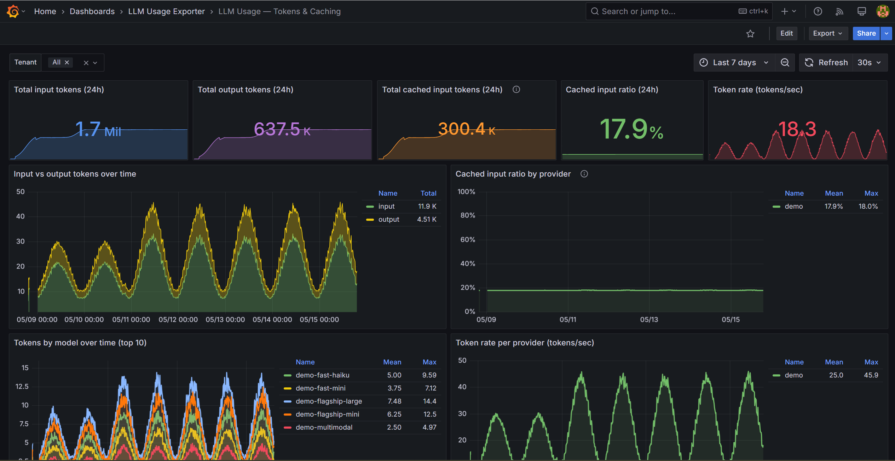

# Metrics catalog

Every provider emits the same canonical metric families under a unified `llm_*` namespace, distinguished only by the `provider` label. The provider is no longer baked into the metric name — it lives on the label set, alongside `tenant`, `model`, and `tenancy_id`.



- `tenant` — single-tenant mode emits `"default"`; multi-tenant mode emits the configured tenant id (see [configuration.md](configuration.md)).
- `provider` — `openai` | `azure_openai` | `anthropic` | `gemini` | `bedrock`.
- `model` — provider-reported model id (sanitized).
- `tenancy_id` — provider-neutral slot for whichever native identifier the upstream API uses to scope organization-level usage: OpenAI / Gemini project, Anthropic workspace, Azure OpenAI resource, Bedrock region. The `provider` label disambiguates which kind of ID applies.

## Usage metrics

| Metric | Labels | Notes |
|---|---|---|
| `llm_usage_input_tokens_total` | `tenant, provider, model, tenancy_id` | All providers |
| `llm_usage_output_tokens_total` | `tenant, provider, model, tenancy_id` | All providers |
| `llm_usage_total_tokens_total` | `tenant, provider, model, tenancy_id` | All providers |
| `llm_usage_cached_input_tokens_total` | `tenant, provider, model, tenancy_id` | Emitted only when the upstream reports prompt-cache hits — currently OpenAI and Anthropic |
| `llm_usage_requests_total` | `tenant, provider, model, tenancy_id` | Every provider except Anthropic (Anthropic's usage API doesn't expose request count) |
| `llm_usage_cost_usd_total` | `tenant, provider, tenancy_id` | All providers |
| `llm_usage_cost_usd_by_model_total` | `tenant, provider, model, tenancy_id` | All providers |

## Exporter health metrics

| Metric | Labels | Purpose |
|---|---|---|
| `llm_exporter_poll_success_total` | `tenant, provider` | Cumulative successful polls per provider |
| `llm_exporter_poll_failure_total` | `tenant, provider` | Cumulative failed polls per provider |
| `llm_exporter_last_success_timestamp` | `tenant, provider` | Unix seconds of last success |
| `llm_exporter_last_failure_timestamp` | `tenant, provider` | Unix seconds of last failure |
| `llm_exporter_last_poll_duration_seconds` | `tenant, provider` | Duration of the most recent poll |

## Cross-cutting alert gauges (no provider label tied to a single source)

| Metric | Labels | Purpose |
|---|---|---|
| `llm_alerts_budget_burn_ratio` | `budget_name` | Spend ÷ limit for the current period — alert > 0.8 |
| `llm_alerts_budget_spend_usd` | `budget_name` | Cumulative spend within the current period |
| `llm_alerts_budget_limit_usd` | `budget_name` | Configured limit for the budget |
| `llm_alerts_budget_period_start_timestamp` | `budget_name` | Unix seconds, start of current period |
| `llm_alerts_cost_anomaly_score` | `tenant, provider, model` | Z-score of latest cost bucket vs rolling baseline, clamped to ±10 |
| `llm_alerts_token_anomaly_score` | `tenant, provider, model` | Z-score of token throughput, clamped to ±10 |

## Canonical scrape output

A single `/metrics` scrape interleaves all enabled providers — one family per metric, dimensioned by `provider`:

```txt
# HELP llm_usage_input_tokens_total Aggregated LLM input tokens.
# TYPE llm_usage_input_tokens_total counter
llm_usage_input_tokens_total{tenant="default",provider="openai",model="gpt-4o-mini",tenancy_id="proj_abc"} 12000
llm_usage_input_tokens_total{tenant="default",provider="azure_openai",model="gpt-4-prod",tenancy_id="/subscriptions/.../accounts/contoso-aoai"} 8400
llm_usage_input_tokens_total{tenant="default",provider="anthropic",model="claude-3-5-sonnet-20240620",tenancy_id="wrkspc_abc"} 5600
llm_usage_input_tokens_total{tenant="default",provider="gemini",model="gemini-1.5-pro",tenancy_id="my-gcp-proj"} 4200
llm_usage_input_tokens_total{tenant="default",provider="bedrock",model="anthropic.claude-3-5-sonnet-20240620-v1:0",tenancy_id="us-east-1"} 9100

# HELP llm_usage_cost_usd_total Aggregated LLM costs in USD, grouped per tenancy.
# TYPE llm_usage_cost_usd_total counter
llm_usage_cost_usd_total{tenant="default",provider="openai",tenancy_id="proj_abc"} 3.14
llm_usage_cost_usd_total{tenant="default",provider="azure_openai",tenancy_id="/subscriptions/.../accounts/contoso-aoai"} 2.05
llm_usage_cost_usd_total{tenant="default",provider="anthropic",tenancy_id="wrkspc_abc"} 1.62
llm_usage_cost_usd_total{tenant="default",provider="bedrock",tenancy_id="us-east-1"} 2.74

# HELP llm_exporter_poll_success_total Total successful polling attempts per provider.
# TYPE llm_exporter_poll_success_total counter
llm_exporter_poll_success_total{tenant="default",provider="openai"} 1
llm_exporter_poll_success_total{tenant="default",provider="azure_openai"} 1
llm_exporter_poll_success_total{tenant="default",provider="anthropic"} 1
llm_exporter_poll_success_total{tenant="default",provider="gemini"} 1
llm_exporter_poll_success_total{tenant="default",provider="bedrock"} 1
```

Label values are trimmed, control characters are replaced, and null or empty values become `unknown`. `user_id` and API-key labels are intentionally excluded to keep cardinality predictable. See [docs/cardinality.md](cardinality.md) for the series-count formula, deployment-size estimates, and label-dropping recipes.

## Cost metric semantics

`llm_usage_cost_usd_total` and `llm_usage_cost_usd_by_model_total` are **operational cost signals** derived from provider billing-history APIs polled on a configurable cadence. They are useful for burn alerts, trend dashboards, and showback. They are not legal accounting records.

### Currency

All cost values are denominated in **USD** as reported by each provider's API.

| Provider | Currency handling |
|---|---|
| OpenAI | Always USD. Organization Costs API returns USD amounts directly. |
| Azure OpenAI | Azure Cost Management returns rows in the subscription's billing currency. The current client skips any row where `currency != "USD"` — those rows appear as zero in the exporter's cost metrics. If your Azure subscription bills in a non-USD currency, cost metrics will read zero until multi-currency support is added (tracked in GitHub Issues). |
| Anthropic | Always USD. Cost Report endpoint returns USD amounts directly. |
| Google Gemini | Depends on the BigQuery billing export and its configured currency. The current query assumes USD; rows in other currencies are not converted. Cost queries are disabled by default (`GEMINI_ENABLE_COST_QUERIES=false`). |
| AWS Bedrock | Always USD. Cost Explorer `GetCostAndUsage` returns USD amounts when `Metrics: ["UnblendedCost"]` is specified. |

### Data freshness by provider

Provider APIs expose **two distinct data streams** with very different freshness characteristics:

- **Token and request data** (what `llm_usage_input_tokens_total`, `llm_usage_requests_total`, etc. are derived from) comes from metering APIs — CloudWatch, Cloud Monitoring, Azure Monitor — that typically reflect usage within minutes of the API call completing.
- **Cost data** (what `llm_usage_cost_usd_total` is derived from) comes from billing-history APIs — Cost Explorer, Azure Cost Management, BigQuery billing export — that finalize hours to days after the underlying spend occurs.

The exporter polls on a fixed interval (default 300 s) but **the freshness of the data it returns is bounded by the provider's publishing lag**, not by the poll interval.

| Provider | Token/request data delay | Cost data delay |
|---|---|---|
| OpenAI | Minutes (Organization Usage API, near-real-time) | ~1–2 hours (Costs API reflects rolling rollups) |
| Azure OpenAI | 1–5 minutes (Azure Monitor) | **24–72 hours** (Cost Management finalization lag; non-USD rows skipped) |
| Anthropic | Minutes (usage_report/messages endpoint) | ~1–4 hours (Cost Report rolls up on a sub-day cadence) |
| Google Gemini | Minutes (Cloud Monitoring timeSeries.list) | **1–2 days** (BigQuery billing export has a ~1-day lag; disabled by default) |
| AWS Bedrock | 1–5 minutes (CloudWatch GetMetricData) | **24–48 hours** (Cost Explorer; unblended cost can shift as credits are applied) |

Budget burn alerts based on `llm_usage_cost_usd_total` will fire **after** the provider reports the spend, not when the API calls happen. For the worst-case providers (Azure, Bedrock, Gemini) a spike that starts now may not appear in cost metrics for 24–72 hours. For early detection, pair cost alerts with token-rate alerts on `llm_usage_total_tokens_total` — token data is available within minutes across all providers and is a reliable leading indicator of cost.

### These are not accounting records

Cost figures may differ from provider invoices due to: unreported credits, delayed billing finalization, volume discounts applied after the fact, currency conversion, and rounding at the provider's API layer. For downstream accounting and chargeback reconciliation, use the FOCUS export at `/focus.csv` and `/focus.json` together with provider invoices as the source of record.

## Querying tips

Because the provider is a label, you can aggregate across providers without `__name__` regex tricks:

```promql
# Total token throughput in the last hour, broken down by provider
sum by (provider) (rate(llm_usage_total_tokens_total[1h]))

# Spend per tenant, all providers combined
sum by (tenant) (rate(llm_usage_cost_usd_total[1h]))

# Per-model cost for one provider
sum by (model) (rate(llm_usage_cost_usd_by_model_total{provider="anthropic"}[24h]))
```

## See also

- [docs/cardinality.md](cardinality.md) — series-count formula, deployment-size estimates, OTLP and Prometheus filtering recipes
- [docs/configuration.md](configuration.md) — env vars that affect every metric (filters, multi-tenant, alerts)
- [docs/provider-apis.md](provider-apis.md) — why each provider's metric shape looks the way it does
- [deploy/alerts/llm-usage-exporter.rules.yml](../deploy/alerts/llm-usage-exporter.rules.yml) — Prometheus alerting rules built on this catalog
