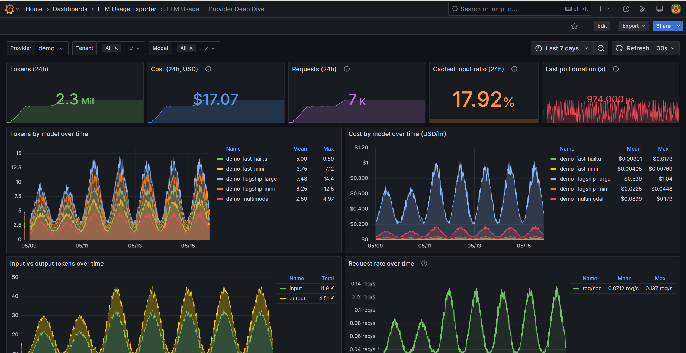

# Provider API notes

Each provider's typed HTTP client mirrors the upstream API's auth and retry semantics. Every client retries on `429` and `5xx` with exponential backoff and surfaces non-transient failures as a provider-specific exception with the HTTP status preserved. Providers with cursor-based pagination use a `seenPages` guard; the compatibility matrix calls out surfaces that are still treated as single-response calls.

## Compatibility matrix

Last verified means "checked against the linked upstream API documentation and the repository's fixture tests"; it does not mean a live credentialed poll was run on that date.

| Provider | API surface | Auth mode | Pagination mode | Last verified | Known limitations |
|---|---|---|---|---|---|
| OpenAI | Organization Usage completions and Organization Costs admin APIs | Admin API bearer token | `has_more` plus `next_page` / `page` cursor | 2026-05-14 | Cost records may expose `line_item` rather than an explicit model, so the exporter maps `line_item` into `model` for by-model cost metrics. Cost data is typically available ~1–2 hours after usage; provider-side rounding and credits applied post-hoc can cause amounts to differ from the final charged figure. |
| Azure OpenAI | Azure Monitor Metrics List for token/request metrics plus Azure Cost Management Query for cost | Microsoft Entra ID client-credentials token for `https://management.azure.com/.default` | Single-response calls in the current client; no `nextLink` traversal yet | 2026-05-14 | **Cost delay: 24–72 hours.** Azure Cost Management has a known data-finalization lag; token metrics from Azure Monitor are near-real-time but cost rows lag behind. Non-USD rows are currently skipped (treated as zero). Resource IDs can be long label values; keep account/resource scope bounded. Add pagination support if Azure returns continuation links for your query shape. |
| Anthropic Claude | Admin Usage Report Messages and Cost Report endpoints | Anthropic admin API key via `x-api-key` and `anthropic-version` headers | `has_more` plus `next_page` cursor | 2026-05-14 | Message usage reports do not provide request counts, so `llm_usage_requests_total` is not synthesized for Anthropic. Cost descriptions are parsed for a model hint when no model field is present. Cost data is typically available ~1–4 hours after usage. |
| Google Gemini | Cloud Monitoring `projects.timeSeries.list` for Vertex AI token/request metrics; optional BigQuery billing export for cost | Static OAuth2 access token or service-account JWT bearer exchange | Cloud Monitoring `nextPageToken`; BigQuery cost query is single-response in the current client | 2026-05-14 | **Cost delay: 1–2 days.** Cost data depends on a configured billing export and is disabled by default (`GEMINI_ENABLE_COST_QUERIES=false`); the BigQuery billing export has a ~1-day lag. Cloud Monitoring metric availability and labels can vary by Vertex AI surface. Add BigQuery result pagination if your billing export query exceeds one response page. |
| AWS Bedrock | CloudWatch `GetMetricData` for token/request metrics plus Cost Explorer `GetCostAndUsage` for cost | AWS Signature Version 4 with access key, secret key, and optional session token | Single-response calls in the current client; no Cost Explorer `NextPageToken` traversal yet | 2026-05-14 | **Cost delay: 24–48 hours.** Cost Explorer data finalizes later than CloudWatch usage, and unblended cost can shift as reserved-capacity credits are applied. Model hints are inferred from `USAGE_TYPE` for cost rows and can be less precise than CloudWatch `ModelId`. Add pagination support if Cost Explorer returns more than one page. |

## OpenAI

The completions usage endpoint supports `start_time`, `end_time`, `bucket_width`, filters, `group_by`, `limit`, and `page` pagination. The costs endpoint supports organization cost buckets and grouping by `project_id`, `line_item`, and `api_key_id`. For `llm_usage_cost_usd_by_model_total{provider="openai"}`, the exporter maps `line_item` to the `model` label when no explicit model field is present.

**Cost reporting delay:** ~1–2 hours. Cost records appear in the Organization Costs API on a near-real-time rolling basis, but may reflect list pricing rather than the final charged amount if promotions or volume discounts apply later in the billing period.

References: [OpenAI usage API](https://developers.openai.com/api/reference/resources/admin/subresources/organization/subresources/usage/methods/completions) · [OpenAI costs API](https://developers.openai.com/api/reference/resources/admin/subresources/organization/subresources/usage/methods/costs) · [credentials runbook](credentials/openai.md)

## Azure OpenAI

Usage is read from Azure Monitor's metrics REST API on `Microsoft.CognitiveServices/accounts` resources (`ProcessedPromptTokens`, `GeneratedTokens`, `TokenTransaction`). Cost is read from the Azure Cost Management `query` endpoint scoped to `subscriptions/{id}` and filtered to `ServiceName = "Cognitive Services"`. Auth uses the Azure AD client-credentials flow against `https://management.azure.com/.default`; the bearer token is cached and refreshed ~60 seconds before expiry.

**Cost reporting delay:** 24–72 hours. Azure Monitor token metrics are near-real-time (available within 1–5 minutes). Azure Cost Management cost rows have a documented finalization lag — data for a given day typically becomes available 24–72 hours later and may be revised as billing finalizes. Non-USD currency rows are currently skipped by the client and appear as zero in cost metrics.

References: [Azure Monitor metrics REST](https://learn.microsoft.com/en-us/rest/api/monitor/metrics) · [Cost Management Query](https://learn.microsoft.com/en-us/rest/api/cost-management/query/usage) · [credentials runbook](credentials/azure-openai.md)

## Anthropic Claude

Usage is read from `GET /v1/organizations/usage_report/messages` with bracketed array filters (`group_by[]`, `workspace_ids[]`, `models[]`, `api_key_ids[]`) and `next_page` cursor pagination. Cost is read from `GET /v1/organizations/cost_report` with the same pagination scheme. Tokens are split into uncached, cached, and cache-creation buckets so prompt-caching dashboards work the same way they do for OpenAI. Headers used: `x-api-key`, `anthropic-version`, `Accept: application/json`.

**Cost reporting delay:** ~1–4 hours. The Anthropic Cost Report reflects billing rollups on a sub-day cadence. Cost descriptions are parsed for a model hint when no explicit model field is present in a cost row; this can result in `model="unknown"` for some entries.

References: [Anthropic Admin API — usage and cost](https://docs.anthropic.com/en/api/admin-api/usage-cost/get-messages-usage-report) · [credentials runbook](credentials/anthropic.md)

## Google Gemini

Usage is read from Cloud Monitoring's `timeSeries.list` API with three separate filters (input tokens / output tokens / request count from `aiplatform.googleapis.com/publisher/online_serving/*`), joined per `(startTime, endTime, model_id)` into a single bucket. Cost is optionally read from a parameterised BigQuery query against the billing export, gated by `GEMINI_ENABLE_COST_QUERIES`. Auth accepts either a pre-issued OAuth2 access token or a service-account JSON keyfile that is exchanged via a hand-rolled JWT-bearer assertion (RS256) — no Google SDK dependency.

**Cost reporting delay:** 1–2 days. Cloud Monitoring token metrics are near-real-time (available within minutes). BigQuery billing export has a ~1-day lag — GCP exports billing data once per day, and the export can take additional hours to complete. Cost queries are disabled by default; when enabled, cost data lags token data by roughly a day. The BigQuery query assumes USD; rows in other billing currencies are not converted.

References: [Cloud Monitoring timeSeries.list](https://cloud.google.com/monitoring/api/ref_v3/rest/v3/projects.timeSeries/list) · [BigQuery billing export](https://cloud.google.com/billing/docs/how-to/export-data-bigquery) · [credentials runbook](credentials/gemini.md)

## AWS Bedrock

Usage is read from CloudWatch `GetMetricData` against the `AWS/Bedrock` namespace (`InputTokenCount`, `OutputTokenCount`, `Invocations`), parsed as the XML query-API response. Cost is read from Cost Explorer `GetCostAndUsage` filtered to `SERVICE = "Amazon Bedrock"` and grouped by `USAGE_TYPE`. Every request is signed inline with AWS SigV4 using `HMACSHA256` from `System.Security.Cryptography` — no AWS SDK dependency.

**Cost reporting delay:** 24–48 hours. CloudWatch token metrics are near-real-time (available within 1–5 minutes). Cost Explorer data finalizes later — unblended cost for a given day typically becomes available 24 hours after the day ends and can shift further as reserved-capacity credits and savings plans are applied. Model resolution is inferred from `USAGE_TYPE` for cost rows, which is less precise than the `ModelId` dimension available in CloudWatch usage metrics.

References: [CloudWatch GetMetricData](https://docs.aws.amazon.com/AmazonCloudWatch/latest/APIReference/API_GetMetricData.html) · [Cost Explorer GetCostAndUsage](https://docs.aws.amazon.com/aws-cost-management/latest/APIReference/API_GetCostAndUsage.html) · [SigV4 signing](https://docs.aws.amazon.com/IAM/latest/UserGuide/reference_aws-signing.html) · [credentials runbook](credentials/aws-bedrock.md)

## See also

- [docs/metrics.md](metrics.md) — what the exporter publishes from each provider's responses
- [docs/credentials/](credentials/) — credential setup for each provider
- [docs/troubleshooting.md](troubleshooting.md) — when a provider stops responding correctly
