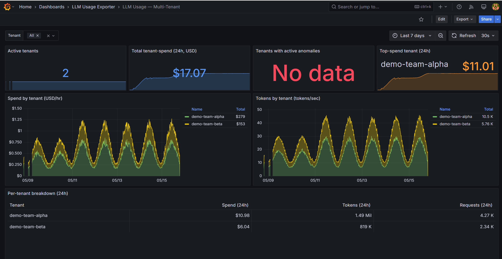

# Tenant isolation

The exporter can run in single-tenant mode (one set of credentials, one `tenant="default"` label on every metric) or multi-tenant mode (multiple credential sets, one per `TenantConfig` entry, filtered metric exposition per tenant). This page documents exactly what is isolated between tenants, what is shared, and the blast radius of a credential or token compromise under each deployment model.



## How tenants are defined

A tenant in this exporter is a named, independently-credentialed polling context. Each tenant:

- Has its own set of provider credentials (API keys, service-principal secrets, AWS credentials).
- Produces metrics labeled with its tenant ID (`tenant="acme"`).
- Can be scraped independently via `/metrics?tenant=acme` with a per-tenant bearer token.

Tenants are declared in `Tenants.Items` in `appsettings.json` (or via environment variables in single-tenant mode). Each `TenantConfig` entry holds a provider block per enabled provider:

```json
{
  "Tenants": {
    "Items": [
      {
        "Id": "acme",
        "Name": "Acme Corp",
        "OpenAi": { "AdminApiKey": "sk-admin-acme", "ProjectIds": ["proj_acme"] }
      },
      {
        "Id": "beta",
        "Name": "Beta Inc",
        "Anthropic": { "AdminApiKey": "sk-ant-admin-beta", "WorkspaceIds": ["wrkspc_beta"] }
      }
    ],
    "ApiKeys": {
      "acme": "scrape-token-acme-prod",
      "beta": "scrape-token-beta-prod"
    }
  }
}
```

## What IS isolated per tenant registration

| Surface | Isolated? | Mechanism |
|---|---|---|
| **Provider credentials** | Yes | Each `TenantConfig` holds its own keys; polling uses tenant-specific `HttpClient` instances with tenant-specific headers |
| **Metric labels** | Yes | Every bucket emitted carries `tenant="<id>"` — the label is set from the `TenantContext` at publish time |
| **Metric exposition** | Yes | `/metrics?tenant=acme` returns only lines containing `tenant="acme"` — other tenants' series are filtered out in `TenantMetricsEndpoint.FilterByTenant` |
| **Scrape authentication** | Yes | Each tenant can have its own bearer token in `Tenants.ApiKeys`; the endpoint enforces it per-request |
| **Checkpoint store keys** | Yes | Deduplication checkpoint keys are prefixed with `tenant | provider | ...` — cross-tenant replay cannot occur |
| **FOCUS export filtering** | Yes | `/focus.csv?tenant=acme` filters rows by tenant (same bearer-token gate) |

## What is NOT isolated per tenant registration

| Surface | Shared | Risk |
|---|---|---|
| **In-process metric registry** | Shared | All tenants' Prometheus counters live in one `DefaultRegistry`; only exposition is filtered per scrape |
| **Memory** | Shared | Usage and cost buckets for all tenants reside in the same process heap |
| **Pod and container** | Shared | One pod hosts all tenants; a process crash or OOM affects all tenants simultaneously |
| **Pod network identity** | Shared | All outbound provider calls originate from the same pod IP and ServiceAccount |
| **OTLP pipeline** | Shared | All tenants' metrics flow through the same OTLP exporter when enabled |
| **Logs** | Shared | All tenant polling events write to the same log stream; log consumers see all tenants |
| **Health endpoint** | Shared | `/health` does not filter by tenant; all providers' health is visible to anyone who can reach the pod |

**Key consequence:** metric isolation is at the *exposition* layer, not the *storage* layer. A bug in the filtering code could expose one tenant's series to another's scrape. A compromise of the process itself (for example, via a container escape or a bug in a dependency) exposes all tenants' credentials and metric data simultaneously.

## Blast-radius table

| Compromised element | Who is affected | Data exposed | Actions to take |
|---|---|---|---|
| **One tenant bearer token** (from `Tenants.ApiKeys`) | That tenant's metric and FOCUS data only | Usage/cost metrics for that tenant; FOCUS rows for that tenant | Rotate that tenant's bearer token; restart pod; no other tenants affected |
| **One tenant's provider credential** (e.g., `acme` OpenAI key) | That tenant's OpenAI account only | Organization-level usage and cost read access for that org | Revoke the compromised key; rotate to new key; restart pod |
| **The Kubernetes Secret holding all credentials** | All tenants and all providers | All provider read access + all scrape tokens | Revoke all provider credentials immediately; rotate Kubernetes Secret; restart pod; audit provider access logs |
| **The exporter pod process** | All tenants and all providers | All credentials currently loaded in memory; all metric data | Kill pod immediately; revoke all credentials; rotate all secrets; audit provider access logs and FOCUS data |
| **The exporter container image** (supply-chain) | All deployments using that image version | Depends on what the attacker inserted | Pin to a known-good digest; rebuild from source; cosign-verify before deploying |

## Deployment models and isolation tradeoffs

### Single deployment, multiple tenants (default multi-tenant mode)

```
┌─────────────────────────────────────────────────┐
│  Pod: llm-usage-exporter                        │
│  ┌──────────┐  ┌──────────┐  ┌──────────┐      │
│  │ acme     │  │ beta     │  │ gamma    │  …   │
│  │ (OpenAI) │  │(Anthropic│  │ (Bedrock)│      │
│  └──────────┘  └──────────┘  └──────────┘      │
│                                                 │
│  In-memory registry  ←  all tenants             │
│  Logs                ←  all tenants             │
│  OTLP pipeline       ←  all tenants             │
└─────────────────────────────────────────────────┘
        ↑                    ↑
  /metrics?tenant=acme   /metrics?tenant=beta
  (bearer token: acme)   (bearer token: beta)
```

**Best for:** Managed AI platforms where the operator (you) controls all tenants and their credentials. The bearer-token gate prevents cross-tenant metric leakage but all credentials are collocated.

**Limitation:** One provider outage or credential failure affects isolation visibility — a noisy-neighbour provider can delay metric collection across all tenants if it exhausts the pod's retry budget.

### One deployment per tenant (full isolation)

```
┌───────────────────┐  ┌───────────────────┐
│ Pod: exporter-acme│  │ Pod: exporter-beta│
│  (acme OpenAI key)│  │  (beta Anthropic) │
└───────────────────┘  └───────────────────┘
       ↑                       ↑
 /metrics (no bearer)    /metrics (no bearer)
```

A separate Helm release (or Deployment) per tenant. Namespacing by tenant is optional.

**Best for:** Regulated environments where different tenants have different data-residency requirements, or where tenant teams manage their own credentials.

**Cost:** N pods instead of one; separate Prometheus scrape jobs; credentials are fully isolated by OS process boundary.

**How to deploy:**

```bash
# Separate Helm release per tenant; each has its own values file
helm upgrade --install exporter-acme ./deploy/helm/llm-usage-exporter \
  --namespace llm-monitoring-acme \
  --values values-acme.yaml

helm upgrade --install exporter-beta ./deploy/helm/llm-usage-exporter \
  --namespace llm-monitoring-beta \
  --values values-beta.yaml
```

### Namespace-per-tenant isolation

In addition to separate Deployments, place each tenant's exporter in its own namespace and apply NetworkPolicy to prevent cross-namespace communication:

```yaml
# Only Prometheus in the monitoring namespace can scrape acme's exporter
apiVersion: networking.k8s.io/v1
kind: NetworkPolicy
metadata:
  name: llm-usage-exporter-ingress
  namespace: llm-monitoring-acme
spec:
  podSelector:
    matchLabels:
      app.kubernetes.io/name: llm-usage-exporter
  policyTypes: [Ingress]
  ingress:
    - from:
        - namespaceSelector:
            matchLabels:
              kubernetes.io/metadata.name: monitoring
      ports:
        - protocol: TCP
          port: 8080
```

See [deploy/network-policy/](../deploy/network-policy/) for ready-to-apply NetworkPolicy templates.

## Bearer token security

The `/metrics?tenant=<id>` endpoint validates the `Authorization: Bearer <token>` header with a constant-time comparison (`CryptographicOperations.FixedTimeEquals`) to prevent timing-oracle attacks. However, bearer tokens have no expiry, no PKCE, and no rotation signal — treat them as long-lived API keys:

- Generate with a CSPRNG: `openssl rand -hex 32`
- Store in the same Kubernetes Secret as the provider credentials (or a separate Secret if tenants manage their own scrape access).
- Rotate on the same schedule as provider credentials.
- If you terminate TLS at an ingress and the bearer token travels over plain HTTP inside the cluster, ensure the ingress is not accessible from the exporter's pod network.

**Avoid:** short tokens (< 32 bytes), sequential IDs, human-readable identifiers, or tokens derived from provider credential material.

## What the exporter does NOT do

To set correct expectations for a security review:

- **No row-level access control inside the metric store.** All tenants' data lives in one Prometheus registry. The filter is applied at exposition time, not write time.
- **No mutual TLS between the exporter and Prometheus.** TLS termination is the responsibility of the service mesh or ingress layer.
- **No credential isolation between OS processes.** One pod = one credential bundle. Use separate Deployments for true process-level isolation.
- **No audit log for scrape events.** Scrape requests are not logged. Rely on your ingress or service-mesh access logs for audit trails.
- **No token expiry.** Bearer tokens are long-lived. Rotate them as part of your credential rotation schedule.

## See also

- [docs/secret-delivery.md](secret-delivery.md) — how to deliver credentials safely via external secret managers
- [docs/least-privilege.md](least-privilege.md) — per-provider IAM minimum permissions
- [docs/security-secrets.md](security-secrets.md) — non-logging guarantee and log redaction fields
- [deploy/network-policy/](../deploy/network-policy/) — NetworkPolicy YAML restricting scrape access
- [docs/cardinality.md](cardinality.md) — series-count impact of multi-tenant deployments
