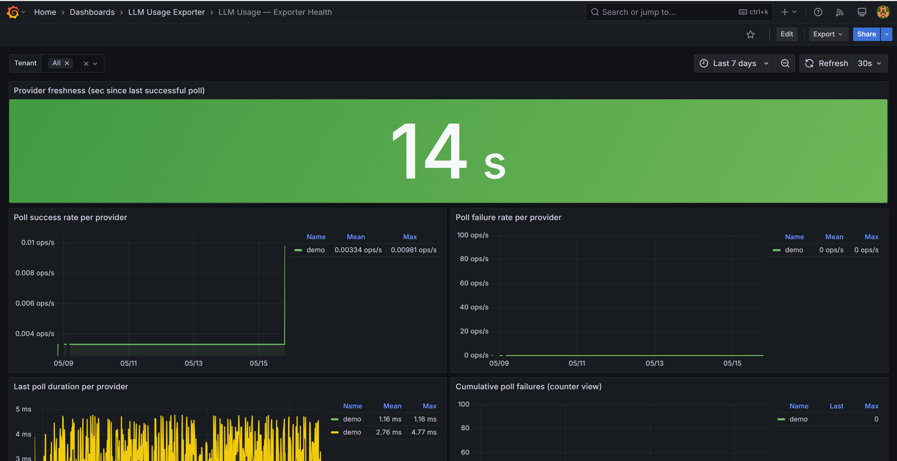

# Troubleshooting

Operational runbook for the `llm-usage-exporter`. Find the symptom that matches what you're seeing; follow the diagnostic steps.

> If you can't find your symptom here, open an issue: https://github.com/xops-labs/llm-usage-exporter/issues
> For private security issues see [SECURITY.md](../SECURITY.md).



## Quick triage

Three commands answer 80% of "what's wrong" questions:

```bash
# 1. Is the exporter alive? Should return 200 with status:healthy.
curl -s http://localhost:8080/health | jq .

# 2. Is Prometheus scraping it?
curl -s 'http://localhost:9090/api/v1/targets?state=active' | jq '.data.activeTargets[]
  | select(.scrapePool=="llm-usage-exporter")
  | {health,scrapeUrl,lastError}'

# 3. Are any providers polling successfully?
curl -s http://localhost:8080/metrics | grep -E '^llm_exporter_(poll_success|last_success_timestamp)'
```

A healthy response from `/health` looks like:

```json
{
  "status": "healthy",
  "consecutiveFailures": 0,
  "failureThreshold": 3,
  "lastSuccessAt": "2026-05-12T14:02:11Z",
  "lastFailureMessage": null,
  "providers": ["openai", "anthropic"]
}
```

If `status` is `unhealthy`, the exporter has hit the consecutive-failure threshold across all enabled providers — jump to "Polling problems" below.

---

## Startup problems

### Symptom: container crash-loops with `OptionsValidationException`

**What you'll see** in pod logs:
```
Unhandled exception. Microsoft.Extensions.Options.OptionsValidationException:
AZURE_OPENAI_TENANT_ID is required.; AZURE_OPENAI_CLIENT_ID is required.; ...
```

**Diagnostic steps:**
1. Check which provider's env vars the message mentions.
2. Verify you set the sentinel env var for that provider (see the table below).
3. If you set the sentinel but not all required fields, the options validator runs and complains — set every required field, or unset the sentinel to opt out entirely.
4. `kubectl describe pod <pod>` to confirm which env vars actually made it into the container (a missing `envFrom` secret will silently leave them blank).

**Root cause patterns:**
- You're on an old build that pre-dates the opt-in fix - upgrade to the latest image.
- You set some of a provider's env vars but not all of the required ones - unset them all to opt out, or set them all to opt in.
- Your Kubernetes secret reference exists but the secret itself is missing the key (results in an empty string, which the validator rejects).

**Fix:** Pull the latest image (`docker pull ghcr.io/xops-labs/llm-usage-exporter:latest`) and confirm the build includes the [opt-in commit](https://github.com/xops-labs/llm-usage-exporter/blob/main/CHANGELOG.md). On the latest build, a provider is enabled iff its sentinel value is set:

| Provider | Sentinel env var | Or appsettings key |
|---|---|---|
| OpenAI | `OPENAI_ADMIN_API_KEY` | `OpenAI:AdminApiKey` |
| Azure OpenAI | `AZURE_OPENAI_TENANT_ID` | `AzureOpenAI:TenantId` |
| Anthropic | `ANTHROPIC_ADMIN_API_KEY` | `Anthropic:AdminApiKey` |
| Gemini | `GEMINI_PROJECT_ID` | `Gemini:ProjectId` |
| Bedrock | `AWS_ACCESS_KEY_ID` | `Bedrock:AccessKeyId` |

### Symptom: container won't start, log says `Exporter:PollIntervalSeconds must be greater than zero`

**What you'll see:**
```
OptionsValidationException: Exporter:PollIntervalSeconds must be greater than zero
```

**Diagnostic steps:**
1. Print the env var as the container sees it: `kubectl exec <pod> -- printenv EXPORTER_POLL_INTERVAL_SECONDS`.
2. Confirm it's a positive integer.

**Root cause patterns:**
- Env var set to a non-numeric value (`"5min"`, `"PT5M"`).
- Env var set to `0` or negative.
- Helm `values.yaml` accidentally quoted the value with a stray space.

**Fix:** `EXPORTER_POLL_INTERVAL_SECONDS=300` (the default) - adjust as needed. The same rule applies to `EXPORTER_LOOKBACK_MINUTES` and `ALERTS_EVALUATION_INTERVAL_SECONDS`.

### Symptom: container starts but immediately segfaults / exits 139

**What you'll see:** Pod restart count climbing fast, exit code 139, no application logs (the process never got far enough to log).

**Root cause patterns:** Almost always a Docker volume mount path issue on Windows host (MSYS path mangling). The container itself is fine; the bind mount didn't resolve.

**Fix:** Confirm with `docker inspect <container> | grep Mounts` that the mount sources resolved to expected host paths. On Git Bash for Windows, prefer PowerShell to run `docker run` commands, or use `MSYS_NO_PATHCONV=1`.

### Symptom: container starts but `File` checkpoint store throws on first poll

**What you'll see:** First poll fails with `UnauthorizedAccessException` or `DirectoryNotFoundException` referencing the checkpoint path.

**Diagnostic steps:**
1. `kubectl exec <pod> -- ls -la <checkpoint-dir>` — does the directory exist and is it writable?
2. Confirm the `securityContext.fsGroup` / `runAsUser` on the pod can write to the mounted volume.

**Root cause patterns:**
- `Checkpoints:Provider=File` but no volume mounted at `Checkpoints:File:Path`.
- Volume mounted read-only.
- Path inside `/tmp` on a read-only root filesystem.

**Fix:** Either mount a writable `emptyDir` / `PVC` at the configured path, or fall back to `Checkpoints:Provider=InMemory` for stateless deployments (you'll lose checkpoint continuity across restarts, which only matters if your provider charges per request to its admin API).

---

## Polling problems (one or more providers stuck)

### Symptom: one provider stuck at 401/403 while others poll fine

**What you'll see:** in pod logs, repeated `<provider> polling failed after 0.xxxs` with HTTP 401/403 / `InvalidClientTokenId` / `invalid x-api-key` / `unauthorized_client`. The `llm_exporter_poll_failure_total{provider="<provider>"}` series climbs while other providers stay flat.

**Diagnostic steps:**
1. Hit the upstream API directly with curl using the same credentials (the per-provider verification command in `docs/credentials/<provider>.md`).
2. If the curl also fails, the credential is bad.
3. If the curl succeeds, the exporter has a stale credential in memory - restart the pod.
4. For Azure / Gemini / Bedrock, also confirm the IAM role / service principal still has the read scope on the usage / billing API.

**Root cause patterns:**
- Credential rotated upstream but the exporter wasn't restarted - restart pod (exporter does not hot-reload credentials).
- IAM permissions narrowed without realizing the exporter needed them - re-grant per the per-cloud runbook.
- Provider's auth endpoint changed - unusual; check the upstream's status page.
- For Bedrock specifically, the credential may be valid but pointed at the wrong region (`AWS_REGION` set to a region with no Bedrock usage).

**Fix:** Per-provider remediation lives in the credential runbook for that provider:
- [docs/credentials/openai.md](credentials/openai.md)
- [docs/credentials/azure-openai.md](credentials/azure-openai.md)
- [docs/credentials/anthropic.md](credentials/anthropic.md)
- [docs/credentials/gemini.md](credentials/gemini.md)
- [docs/credentials/aws-bedrock.md](credentials/aws-bedrock.md)

### Symptom: all providers stuck, exporter unhealthy

**What you'll see:** `/health` returns 503, every `llm_exporter_poll_failure_total{provider=~".+"}` series is incrementing.

**Diagnostic steps:**
1. Check pod's network connectivity (egress allowed to each provider's API endpoint?).
2. Check NodeLocalDNS / CoreDNS - DNS failures look like all upstreams being down.
3. Check pod's CPU / memory - OOMKilled mid-poll looks like every poll failing.
4. `kubectl logs <pod> --previous` if the pod is restarting — the prior incarnation's stack trace often makes the cause obvious.

**Root cause patterns:**
- Network egress policy blocks `api.openai.com`, `api.anthropic.com`, `monitoring.googleapis.com`, etc.
- DNS resolution broken.
- Resource constraints (OOMKilled - look for `Reason: OOMKilled` in `kubectl describe pod`).
- Outbound HTTP proxy required but `HTTPS_PROXY` not configured.

**Fix:** Verify egress with `kubectl exec <pod> -- curl -v https://api.openai.com`. If blocked, update your `NetworkPolicy`. If OOMKilled, raise `resources.limits.memory` in Helm values. If behind a proxy, set `HTTPS_PROXY` / `NO_PROXY` on the pod spec.

### Symptom: `/health` is 503 but the upstream APIs are fine

**What you'll see:** `consecutiveFailures` field in `/health` response is >= `failureThreshold` (default 3), but `curl`-ing the upstream from inside the pod works.

**Diagnostic steps:**
1. Check `EXPORTER_FAILURE_THRESHOLD` - if you tightened it for testing, restore the default.
2. Look at the most recent `lastFailureMessage` in the JSON for the actual upstream error.
3. Inspect timestamps — if `lastSuccessAt` is recent, the threshold is just slow to reset (it only resets on success).

**Fix:** Get the upstream working first; the exporter resets `consecutiveFailures` to zero on the first successful poll. If you need to force-clear without waiting for the next interval, restart the pod.

### Symptom: polls succeed but take 30+ seconds

**What you'll see:** `llm_exporter_last_poll_duration_seconds{provider="<provider>"}` consistently > 30; downstream Prometheus scrapes occasionally time out.

**Diagnostic steps:**
1. Compare `EXPORTER_LOOKBACK_MINUTES` to your traffic — wide lookbacks force the upstream to return more pages.
2. Check the provider's status page for elevated latency.
3. For Bedrock, the CloudWatch query API is rate-limited per-account — concurrent exporters in the same account will throttle each other.

**Fix:** Narrow the lookback window, or split high-traffic providers across separate exporter instances. The exporter is single-process per provider — there's no internal concurrency cap to raise.

---

## Metrics / dashboard problems

### Symptom: dashboards empty, /metrics has only the alert gauges

**What you'll see:** `curl http://localhost:8080/metrics | grep _usage_` returns nothing, but `llm_alerts_*` gauges are present.

**Diagnostic steps:**
1. Wait. The default poll interval is 300s - no usage metrics appear until the first successful poll completes.
2. Check `llm_exporter_poll_success_total{provider="<provider>"}` — should be incrementing.
3. Check the time window - if the provider has had no usage in the lookback window (60min), there's nothing to publish.

**Root cause patterns:**
- First-time install, not enough time elapsed.
- Provider organization has had zero usage in the lookback window.
- Polls are succeeding but all returning empty results (lookback too tight, no traffic).

**Fix:** Confirm the upstream actually has data in the polling window by hitting the upstream API directly. Adjust `EXPORTER_LOOKBACK_MINUTES` if your traffic is bursty / sparse.

### Symptom: dashboards show stale data, last-success freshness panel is red

**What you'll see:** in the "LLM Usage — Overview" dashboard, the per-provider freshness panel is red for one or more providers. PromQL: `time() - max by (provider) (llm_exporter_last_success_timestamp) > 1800`.

**Diagnostic steps:**
1. Match to "one provider stuck" or "all providers stuck" above.
2. If exporter is healthy but some providers haven't polled recently - check pod uptime; the lookback window may not have elapsed since pod start.
3. Check whether the pod was recently restarted — `llm_exporter_last_success_timestamp` resets to zero until the first post-restart poll completes.

**Fix:** Apply the appropriate remediation from above.

### Symptom: cardinality explosion / Prometheus running out of memory

**What you'll see:** Prometheus pod memory creeping up; `prometheus_tsdb_head_series` growing fast; queries getting slow.

**Diagnostic steps:**
1. `curl http://localhost:8080/metrics | wc -l` - should be tens to low hundreds of lines under default labels.
2. Check for an unexpected label expansion via `count by (provider, model) (llm_usage_total_tokens_total)` in Prometheus.
3. List the top-cardinality series: `topk(20, count by (provider, model, tenancy_id) ({__name__=~"llm_usage_.+"}))`.

**Root cause patterns:**
- Someone enabled high-cardinality labels via filter env vars in production (e.g. `OPENAI_USER_IDS` populated).
- Multi-tenant deployment with many tenants × many models × many projects multiplied through.
- A misbehaving client is rotating model names or sending free-form `user` values that flow through to the upstream usage API.

**Fix:** Drop the high-cardinality filter env vars (`OPENAI_USER_IDS`, `OPENAI_API_KEY_IDS`, etc.) - Prometheus is not the right storage for user-level analysis. For that grain, use the FOCUS export at `/focus.json` plus an OLAP store.

### Symptom: Anthropic provider has no `llm_usage_requests_total{provider="anthropic"}` series

**What you'll see:** The metric family exists for other providers but has no Anthropic series.

**Root cause:** Anthropic's admin usage API does not return request counts — only token counts and cost. The exporter does not emit Anthropic request-count series by design.

**Fix:** No fix needed. For Anthropic, use `llm_usage_total_tokens_total{provider="anthropic"}` as a proxy for activity. Same applies to `llm_usage_cached_input_tokens_total` — only OpenAI and Anthropic expose it.

### Symptom: FOCUS export returns 200 but body is empty / `[]`

**What you'll see:** `curl http://localhost:8080/focus.json` returns `[]`, or `/focus.csv` returns just the header row.

**Diagnostic steps:**
1. Confirm at least one provider has completed a successful poll (same checks as "dashboards empty" above).
2. The FOCUS export reflects the same lookback window as Prometheus metrics — if there's no usage in the window, FOCUS is empty.

**Fix:** Wait for a poll cycle, or widen `EXPORTER_LOOKBACK_MINUTES`. FOCUS records are derived from the same in-memory aggregates that drive `/metrics`.

---

## Alerting problems

### Symptom: budget gauges are zero / empty

**What you'll see:** `llm_alerts_budget_burn_ratio` and `llm_alerts_budget_spend_usd` return no series.

**Diagnostic steps:**
1. Check the `Alerts:Budgets[]` config section - empty config means no budgets, means no series.
2. Verify the appsettings ConfigMap is mounted correctly (in Kubernetes deployments).
3. Wait for the next `ALERTS_EVALUATION_INTERVAL_SECONDS` cycle (default 60s) after the first poll completes.
4. `kubectl exec <pod> -- cat /app/appsettings.Production.json | jq .Alerts.Budgets` to confirm the config reached the container.

**Root cause patterns:**
- Budget config never reached the pod (ConfigMap mounted at wrong path, JSON malformed).
- Polls haven't completed yet so there's no spend to evaluate.
- Budget filters (Tenants / Providers / Models / Tenancies) exclude all current spend.

**Fix:** See [docs/deployment.md](deployment.md) → "Wire budgets via a ConfigMap" for the canonical ConfigMap example.

### Symptom: anomaly z-scores stuck at 0 or never firing

**What you'll see:** `llm_alerts_cost_anomaly_score` always reads 0 or NaN. Token-anomaly counterpart `llm_alerts_token_anomaly_score` behaves the same.

**Diagnostic steps:**
1. Confirm spend buckets are arriving — `llm_usage_cost_usd_total{provider="<provider>"}` should be moving.
2. Check `ALERTS_ROLLING_WINDOW_BUCKETS` - z-score needs at least a few buckets of history before it produces a meaningful signal.
3. Verify `ALERTS_ENABLED=true` (the default).

**Root cause patterns:**
- Brand-new deployment - the rolling window hasn't filled yet.
- Window too wide (`ALERTS_ROLLING_WINDOW_BUCKETS=1000`) and recent spikes get averaged away.
- Spend is so consistent that the z-score legitimately is zero - not a bug.

**Fix:** Wait for at least 5-10 polling cycles after deployment for the z-score to mean anything. The score is clamped to ±10 so even brand-new providers won't produce wild signals.

### Symptom: Alertmanager rules not firing despite obvious metric thresholds being crossed

**What you'll see:** A metric is clearly past its rule threshold in Prometheus's graph view, but no alert is firing in Alertmanager.

**Diagnostic steps:**
1. Visit Prometheus UI → Alerts - confirm the alert state (Pending / Firing / Inactive).
2. If Pending, the `for:` duration hasn't elapsed yet.
3. If Inactive, the `expr` isn't matching - paste it into Prometheus UI to debug.
4. If Firing but no notification, the issue is Alertmanager routing, not the rule.

**Fix:** Use `promtool check rules deploy/alerts/llm-usage-exporter.rules.yml` to validate syntax. See [deploy/alerts/README.md](../deploy/alerts/README.md) for wiring details.

---

## OTLP / tracing problems

### Symptom: OTLP backend receives nothing despite `OTEL_EXPORTER_OTLP_ENDPOINT` being set

**What you'll see:** The exporter is healthy, polls succeed, but your tracing backend (Jaeger / Tempo / Honeycomb / etc.) shows no spans from `llm-usage-exporter`.

**Diagnostic steps:**
1. Confirm the endpoint URL is reachable: `kubectl exec <exporter-pod> -- nc -zv otel-collector 4317`.
2. Confirm the protocol matches: gRPC on 4317, HTTP/protobuf on 4318.
3. Check the exporter's logs for OTLP exporter errors (search for `OtlpExporter` or `Failed to export`).

**Root cause patterns:**
- Wrong port (4317 vs 4318) for the chosen protocol.
- TLS mismatch (collector expects TLS but exporter sends plaintext, or vice versa).
- DNS resolution from inside the pod fails for the endpoint hostname.
- Collector's receiver is configured but not actually listening on the expected interface (`0.0.0.0` vs `127.0.0.1`).

**Fix:** Match protocol to port. For in-cluster Collector with no TLS, use `OTEL_EXPORTER_OTLP_PROTOCOL=grpc` and a `http://` (not `https://`) endpoint. See [deploy/otel-collector/README.md](../deploy/otel-collector/README.md) for a worked example.

### Symptom: OTLP backend shows "counter reset" warnings or metrics appear as saw-tooth instead of rates

**What you'll see:** In Datadog or New Relic, metric graphs show a saw-tooth pattern — a value that jumps to the cumulative total on each export interval and then appears to "reset." The backend may also log `counter reset detected` or similar warnings. In Grafana with a delta-expecting backend, rate calculations look inflated.

**Root cause:** The exporter defaults to **cumulative** temporality — every export batch contains the running total since startup. A delta-preferring backend interprets each batch as a new counter starting from zero, treats the cumulative value as a large initial increment, and then flags the next interval's slightly-larger value as the rate. This produces a constant "rate" equal to the cumulative total divided by the export interval, which is always decreasing as the denominator grows.

**Fix — two options:**

Option A (recommended when routing to multiple backends): Enable the `cumulativetodelta` processor in the OTel Collector metrics pipeline. The processor block is already in `deploy/otel-collector/otel-collector-config.yaml` (commented out). Uncomment it and add it before `batch` in the metrics pipeline:

```yaml
service:
  pipelines:
    metrics:
      processors: [resource, cumulativetodelta, batch]
```

The `cumulativetodelta` processor requires the **contrib** collector build (`otel/opentelemetry-collector-contrib`). See [deploy/otel-collector/README.md](../deploy/otel-collector/README.md#metric-temporality) for the full backend-specific guidance.

Option B (single downstream OTLP backend): Set the env var on the exporter:

```
OTEL_EXPORTER_OTLP_METRICS_TEMPORALITY_PREFERENCE=Delta
```

Do not use Option B if you also feed a Prometheus-compatible backend (Grafana Mimir, VictoriaMetrics, AMP, Grafana Cloud) from the same OTLP stream — those backends prefer cumulative and will display incorrect data if they receive delta instruments.

### Symptom: traces appear but lack `traceparent` propagation to downstream provider spans

**What you'll see:** Spans from the exporter itself show up, but they look orphaned — no child spans on the upstream API call.

**Root cause:** First check whether outbound propagation was intentionally disabled with `OTEL_TRACE_CONTEXT_PROPAGATION_ENABLED=false`. If it is enabled, the most common cause is that the downstream provider/proxy does not accept or honor `traceparent`; most public LLM APIs do not join the trace back to you.

**Fix:** If your governance policy allows trace IDs to cross the provider boundary, leave `OTEL_TRACE_CONTEXT_PROPAGATION_ENABLED=true` and confirm the upstream / proxy supports W3C Trace Context. If policy forbids that boundary crossing, keep the flag disabled and treat provider HTTP spans as exporter-local only.

---

## Multi-tenant problems

### Symptom: `/metrics?tenant=<id>` returns 401

**What you'll see:**
```
HTTP/1.1 401 Unauthorized
WWW-Authenticate: Bearer
```

**Root cause:** `Tenants:ApiKeys:<id>` is configured but the request doesn't carry a matching `Authorization: Bearer <token>` header.

**Fix:** Send the bearer token: `curl -H "Authorization: Bearer <token>" http://localhost:8080/metrics?tenant=<id>`. To turn off auth entirely, unset `Tenants:ApiKeys`.

### Symptom: `/metrics?tenant=<id>` returns empty

**What you'll see:** 200 OK but the response body contains no series with the expected `tenant="<id>"` label.

**Root cause patterns:**
- Tenant ID typo.
- Tenant configured in `Tenants:Items` but its providers haven't successfully polled yet.
- Tenant has zero usage in the lookback window.

**Fix:** `curl http://localhost:8080/metrics | grep 'tenant="<id>"'` to confirm any series exist for that tenant. If the unfiltered scrape contains no rows for that tenant, the issue is upstream of the filter — work back through the polling-problems section above.

### Symptom: tenant `tenant_a` sees data that belongs to `tenant_b`

**What you'll see:** Series with the wrong tenant label, or cost rolling up into the wrong tenant on the dashboard.

**Diagnostic steps:**
1. Confirm each tenant in `Tenants:Items[]` has its own credential block, not a shared one.
2. Confirm two tenants aren't pointing at the same OpenAI org / Azure subscription / GCP project / AWS account by mistake.

**Fix:** Tenant attribution is sourced from the credentials each tenant ships with. If two tenants share an upstream org, the upstream usage API can't distinguish them and they will appear merged. Split the upstream tenancy, or accept the merge.

---

---

## Failure-mode reference

The table below is a quick lookup for known adverse conditions. Each row links to the full per-scenario analysis in [docs/failure-modes.md](failure-modes.md), which includes the exact metric signal, the applicable alert, and step-by-step recovery.

| Scenario | Immediate effect | Primary metric signal | Alert |
|---|---|---|---|
| Provider 429 / rate-limiting | Poll aborts for that provider | `llm_exporter_poll_failure_total{provider}` ↑ | `LlmUsageExporterPollFailures` (warning, >3 in 15 m) |
| Provider 5xx | Same as 429 | Same | Same |
| Bad / expired credentials | Repeated poll failures; no data for that provider | `llm_exporter_poll_failure_total` ↑; `llm_exporter_last_success_timestamp` goes stale | `LlmUsageExporterPollFailures` → then `LlmUsageExporterStale` after 30 m |
| Repeated cursor (provider re-emits a bucket) | Checkpoint deduplication absorbs the replay; no counter movement | No change — correct behavior | None |
| OTLP endpoint down | OTLP writes fail; Prometheus exposition continues normally | `otelcol_exporter_send_failed_metric_points_total` ↑ on the collector | Configure a collector-side alert on that metric |
| Prometheus scrape failure | Gap in TSDB; metric values held in registry | `up{job="llm-usage-exporter"} == 0` | `LlmUsageExporterDown` (critical, after 5 m) |
| Checkpoint write failure | Publisher skips metrics for that iteration; error logged | `llm_exporter_last_success_timestamp` creeps upward | `LlmUsageExporterStale` if sustained |
| Process restart | File checkpoint reloads; first poll deduplicates; Prometheus counters reset | Counter reset (handled by `increase()`) | None (lifecycle managed by Kubernetes) |

For the complete per-scenario write-up including what does **not** happen and the exact recovery steps, see [docs/failure-modes.md](failure-modes.md).

For HA, multi-replica caveats, and checkpoint store options, see [docs/ha-and-checkpoints.md](ha-and-checkpoints.md).

---

## When to file an issue

If after walking the above the problem doesn't have a clear remediation, open a bug at https://github.com/xops-labs/llm-usage-exporter/issues with:

- The full output of `curl http://localhost:8080/health`
- The output of `curl http://localhost:8080/metrics | grep ^llm_exporter_`
- Pod logs from the last 5 minutes (redact any credentials!)
- Your exporter version (`<image>:<tag>` or git SHA)
- Cloud(s) and provider(s) involved

For private security disclosure see [SECURITY.md](../SECURITY.md). Never paste credentials, API keys, OTLP headers, or tenant bearer tokens into a public issue.
